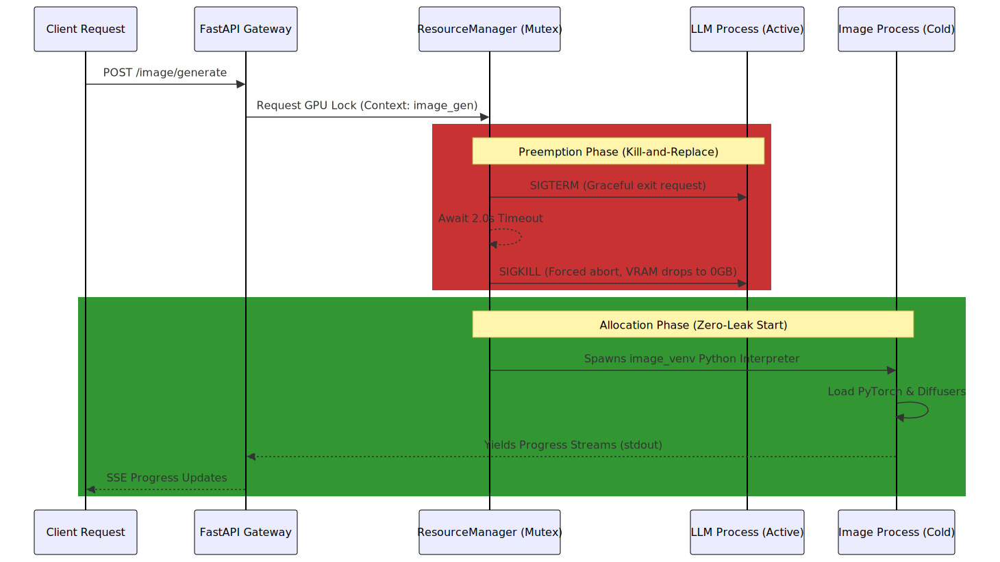

# 🏰 NEURAL CITADEL
**Strict Subprocess Isolation for Multi-Model AI Orchestration on Edge Hardware**

---

*Neural Citadel is a proprietary, monolithic AI serving platform engineered to reliably orchestrate over 40 heterogeneous machine learning models—spanning high-resolution vision, dense reasoning, and media processing—on consumer-grade hardware with strict 4GB VRAM limits.*

---

## 🔬 Systems Architecture Overview

Conventional AI serving methodologies rely on in-process model swapping or heavy Docker containerization (`Triton`, `TorchServe`), both of which fail on severely constrained consumer GPUs due to progressive CUDA memory fragmentation and ghost reference cycles.

Neural Citadel introduces an **OS-Level Subprocess Isolation Architecture**. By delegating all machine learning execution to isolated Python subprocesses bound to dedicated virtual environments, the system guarantees a mathematically provable **zero-leak VRAM reclamation** upon process termination.

### 1. Dual-Client Bridge Pattern

The overarching system is designed to expose the same intelligence core to fundamentally disjointed client environments without code duplication.

  

*   **Desktop Edge Client (PyQt):** Bypasses all network overhead to spawn underlying AI engines directly via native `QProcess` bindings.
*   **Mobile Client (Flutter):** Connects to the highly optimized FastAPI gateway. The gateway imports *zero* machine learning dependencies (`torch`, `diffusers`), ensuring the host RAM is entirely preserved for the backend inference engines.

---

## ⚙️ Process Lifecycle & VRAM Orchestration

Running over 40 gigabytes of cumulative model weights sequentially across a 4GB VRAM boundary mandates strict, programmatic hardware defense mechanisms.

### The Subprocess Mutex Mechanism

  

### IPC Protocols: Dual-Mode Execution
To overcome the 10-30s latency introduced by Python interpreter cold-starts, Neural Citadel establishes two unified IPC (Inter-Process Communication) protocols via standard `stdin/stdout`:
1.  **One-Shot Batching (`yield` pipelines):** High-latency rendering models (Diffusion, Background Swap) execute a cycle and immediately self-terminate, yielding continuous JSON progress dictionaries directly to the gateway listener.
2.  **Persistent Streaming (`stdin` loops):** Interactive agents (DeepSeek R1, LLaMA) initialize the model into RAM once, entering an infinite `while True: readline()` loop. Context is preserved until the `ResourceManager` explicitly pre-empts them via an external context switch.

---

## 🌐 The Heterogeneous Engine Ecosystem

The core strength of Neural Citadel lies in its massive, federated backend containing 12 standalone engines. Each application runs inside its own isolated Python environment, allowing fundamentally incompatible frameworks to coexist.

| Domain | Pipeline Engine | Core Mechanisms & Architectures |
|:---|:---|:---|
| **Vision** | 🎨 **Image Gen** | 478-line DiffusionEngine auto-routing models across 14 categorical pipelines. Implements 6 schedulers, 3 ControlNets (Depth/Canny/Pose), and a customized `PromptEnhancer` leveraging scraped CivitAI modifier tokens. |
| **Vision** | 🔪 **Image Surgeon** | A 6-stage compositional pipeline chaining `GroundingDINO` (zero-shot box extraction), `SAM2` (sub-pixel masking), `SegFormer`, and `CatVTON` for advanced background alteration and virtual try-ons. |
| **Parsing** | 📸 **Captioner** | `BLIP-2` vision-language parsing. Instructed explicitly to route inference paths to CPU-only execution threads to prevent mutex blocking of the active GPU. |
| **Logic** | 🤖 **LLM Agent** | Persistent stdin/stdout factory mapped to DeepSeek-R1 (with active Chain-of-Thought `/think` stream detection), DeepSeek Coder, Mistral, and specialized hacking personas. |
| **Media** | 🎬 **Downloader** | Multi-source media acquisition pulling from YouTube (`yt-dlp`), YTS/TPB torrent APIs (`libtorrent`), localizing subtitles (`Whisper`), and terminating with automated `ClamAV` virus scanning schemas. |
| **Agents** | 📲 **Social Automation** | End-to-end Short Form content creation loops executing dynamic script generation, audio TTS synthesis, and automated posting loops via hybrid API and headless Selenium drivers. |
| **Print** | 📰 **News Publisher** | Automated RSS data aggregation traversing 135+ global feeds, translated locally, and synthesized into high-density magazine PDFs using parameterized `ReportLab` layouts. |
| **Utility** | 📱 **QR Studio** | 374-type semantic layout parser capable of generating algorithmic SVG matrices, embedded gradient canvases, and Stable Diffusion masked artistic outputs. |

---

## 📶 Turing-Era Inference Stabilizations

To successfully route modern diffusion workloads specifically on the NVIDIA GTX 1650 (TU117 architecture), the generation pipelines employ an extreme optimization stack:

1.  **Forced FP32 Precision:** Empirical testing proves that executing Stable Diffusion via `torch.float16` on TU117 architectures triggers catastrophic `NaN` cascades within the VAE decoder logic. The platform forces absolute Float32 stability.
2.  **Pipeline Compression Array:** The 6.8GB baseline memory requirement of FP32 models is compressed to just **~1.5GB** peak allocation by sequentially binding:
    *   `enable_sequential_cpu_offload()`: Layer-by-layer VRAM-to-RAM swapping.
    *   `enable_vae_slicing()` & `enable_vae_tiling()`: Segmented decoding passes.
    *   `enable_attention_slicing("max")`: Cross-attention memory trading.

---

## 📱 Mobile Citadel Frontend Architecture

The Flutter mobile client (`apps/mobile_citadel`) operates inversely to conventional REST clients by executing substantial hardware-accelerated computation locally to relieve infrastructure latency.

*   **System-Level Dynamic Island**: A 605-line Dart Isolate (`neural_pulse_overlay.dart`) persists a glassmorphic waveform simulation atop the Android OS hierarchy, bypassing main-thread UI suspensions via `FlutterOverlayWindow`.
*   **Default Dialer Replacement**: 2,500+ lines of native telephony interception code directly overriding the stock Android dialer, relying on real-time `EventChannel` data to map Android Call States (DIALING, RINGING, ACTIVE) to the UI immediately.
*   **Hardware-Accelerated Physics Rendering**: 12 custom `Ticker`-driven `.dart` algorithms rendering visual events exactly at 60 FPS—including differential spin accretion disks mimicking Keplerian black-hole gravity equations, and raycast-steered asteroid impact simulations.
*   **Offline Intention Parsing**: A 150+ offline application registry routes "Hey Neural" wake-words to local package intents via internal hard-reset STT recovery routines.

---

## ⚠️ Proprietary License & Legal Enforcement

> **This Repository contains Explicitly Proprietary Software. It is NOT Open-Source.**

This repository exists publicly strictly as a professional engineering artifacts portfolio demonstrating hyper-efficient systems architecture, VRAM management, and multi-modal orchestration logic.

**Under no circumstances are any individuals or entities permitted to:**
*   Clone, build, distribute, execute, or utilize this software in a personal, commercial, or academic capacity.
*   Extract architectural logic, Dart rendering algorithms, or Python engine wrappers to construct derivative works.
*   Incorporate this codebase, either entirely or partially, into datasets utilized for training, refining, or tuning Machine Learning Models, Language Agents, or Code-Generation Entities.
*   Reverse-engineer or bypass the hardware locking mechanisms and IPC standards documented herein.

Please refer to the `LICENSE` file enforced within the root directory for absolute legal parameters regarding intellectual property assertion.

   
  <i>Architected, engineered, and mathematically tuned by <b>Biswadeep Tewari</b>.</i>
   
  <a href="https://github.com/RajTewari01">GitHub Profile</a>

