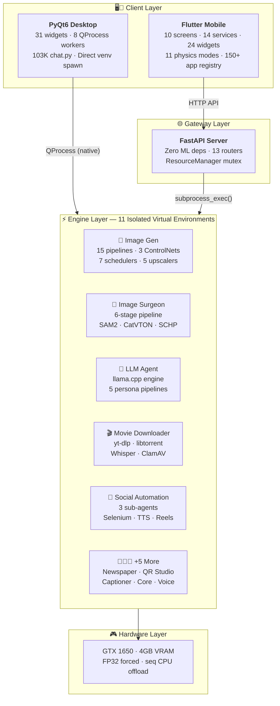
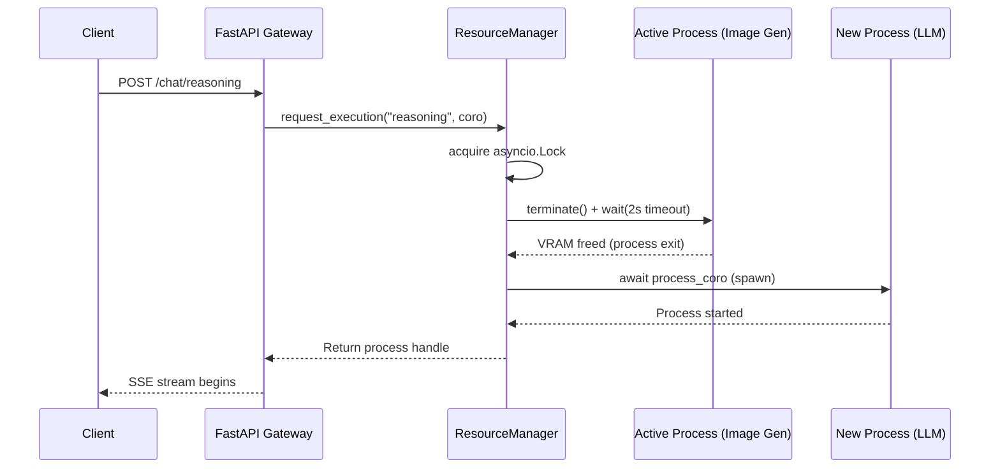
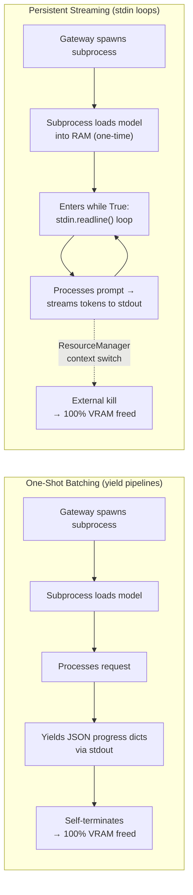
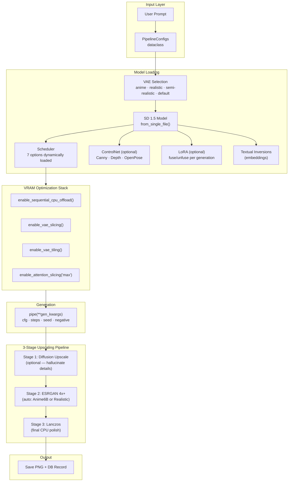
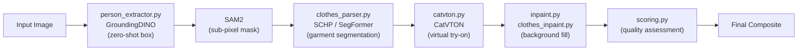
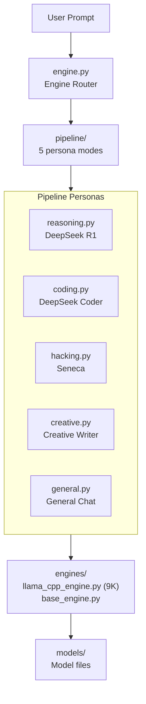
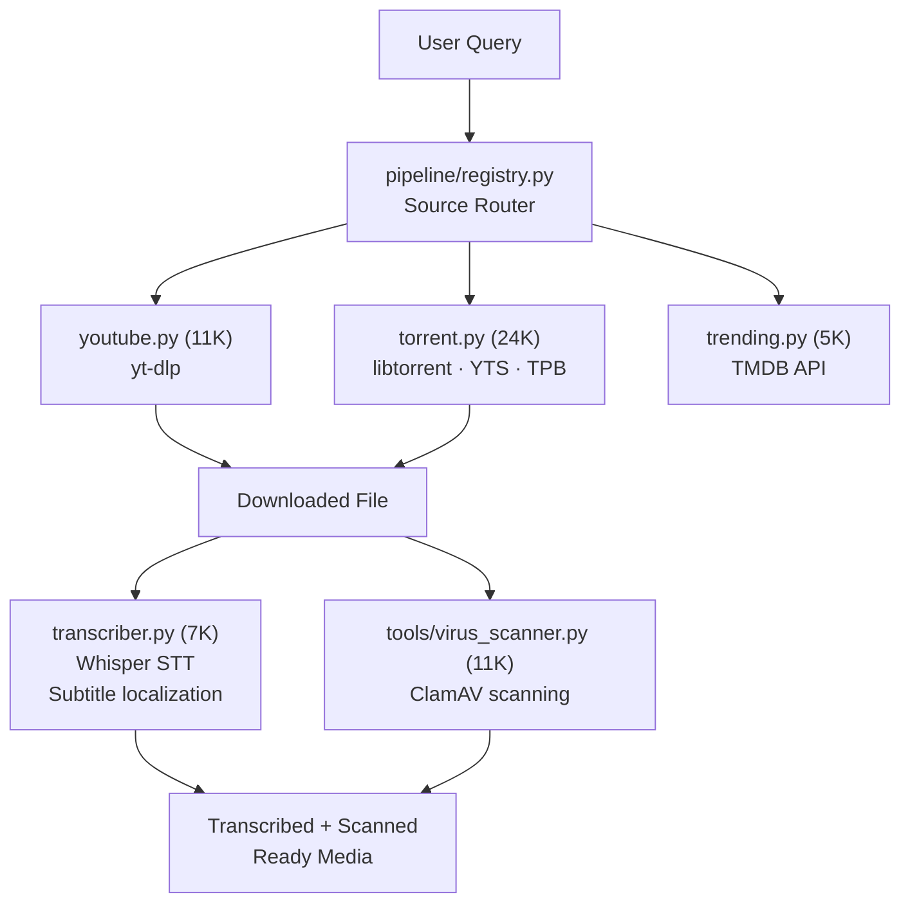
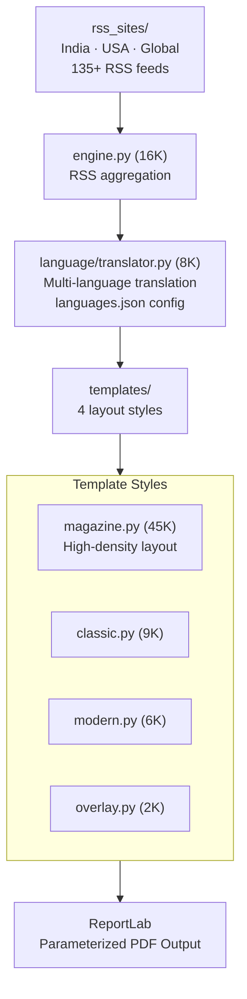
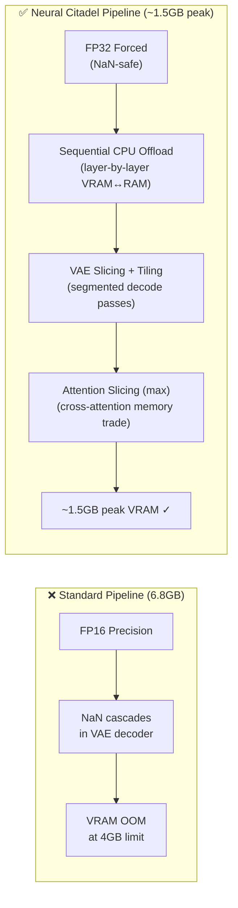
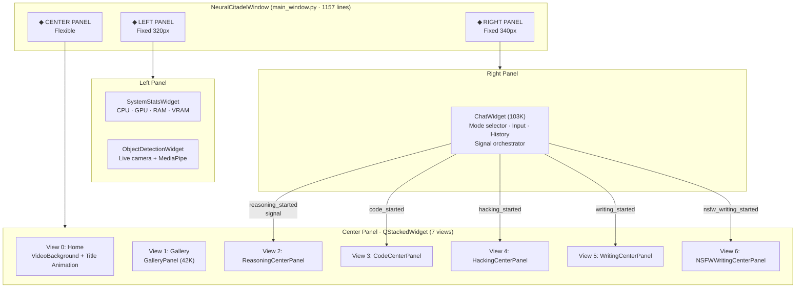

<div align="center">

# 🏰 NEURAL CITADEL

**OS-Level Subprocess Isolation for Multi-Model AI Orchestration on 4GB Edge Hardware**

[](LICENSE)
[](.github/workflows/)
[](#-systems-architecture)
[](#-turing-era-inference-stabilization)
[](#-gateway-architecture--router-matrix)
[](#-desktop-citadel-architecture)
[](#-mobile-citadel-architecture)
[](#-the-heterogeneous-engine-ecosystem)
[](#%EF%B8%8F-virtual-environment-isolation-matrix)

---

*Neural Citadel is a proprietary, monolithic AI platform engineered to reliably orchestrate 40+ heterogeneous machine learning models — spanning high-resolution diffusion, dense reasoning, media acquisition, and social automation — on consumer-grade hardware with a strict 4GB VRAM limit. It achieves this through OS-level subprocess isolation, a dual-client bridge pattern pairing a native PyQt6 desktop interface with a Flutter mobile application, and a zero-ML-dependency FastAPI coordination gateway.*

</div>

---

## 📑 Table of Contents

- [🔬 Systems Architecture](#-systems-architecture)
  - [Dual‑Client Bridge Pattern](#dual-client-bridge-pattern)
  - [Architecture Diagram](#architecture-diagram)
- [🌐 Gateway Architecture & Router Matrix](#-gateway-architecture--router-matrix)
  - [Router Table](#router-table)
  - [ResourceManager Mutex](#resourcemanager-mutex)
  - [Request Lifecycle](#request-lifecycle)
- [📡 IPC Protocols: Dual‑Mode Execution](#-ipc-protocols-dualmode-execution)
- [🧬 The Heterogeneous Engine Ecosystem](#-the-heterogeneous-engine-ecosystem)
  - [Image Generation Pipeline](#-image-generation-pipeline)
  - [Image Surgeon Pipeline](#-image-surgeon-pipeline)
  - [LLM Agent Architecture](#-llm-agent-architecture)
  - [Movie Downloader Pipeline](#-movie-downloader-pipeline)
  - [Newspaper Publisher Pipeline](#-newspaper-publisher-pipeline)
  - [QR Studio Pipeline](#-qr-studio-pipeline)
  - [Social Automation Stack](#-social-automation-stack)
- [🧠 Standalone Inference Engines](#-standalone-inference-engines)
- [⚙️ Virtual Environment Isolation Matrix](#%EF%B8%8F-virtual-environment-isolation-matrix)
- [📶 Turing‑Era Inference Stabilization](#-turing-era-inference-stabilization)
- [🖥️ Desktop Citadel Architecture](#%EF%B8%8F-desktop-citadel-architecture)
- [📱 Mobile Citadel Architecture](#-mobile-citadel-architecture)
  - [Screen Architecture](#screen-architecture)
  - [Service Layer](#service-layer)
  - [Voice Commander](#voice-commander)
  - [Physics Engine](#physics-engine)
  - [Widget Library](#widget-library)
- [🏗️ Monorepo Layout](#%EF%B8%8F-monorepo-layout)
- [🛠️ Technology Stack](#%EF%B8%8F-technology-stack)
- [🔄 CI/CD Pipeline](#-cicd-pipeline)
- [⚠️ Proprietary License & Legal](#%EF%B8%8F-proprietary-license--legal-enforcement)

---

## 🔬 Systems Architecture

Conventional AI serving relies on in-process model swapping or Docker containerization (`Triton`, `TorchServe`), both of which fail on consumer GPUs due to progressive CUDA memory fragmentation and ghost reference cycles.

Neural Citadel solves this with an **OS-Level Subprocess Isolation Architecture**: all machine learning execution is delegated to isolated Python subprocesses bound to dedicated virtual environments, guaranteeing **zero-leak VRAM reclamation** upon process termination.

### Dual-Client Bridge Pattern

The system exposes the same intelligence core to two fundamentally different client environments **without code duplication**, via two distinct control paths:

| Client | Protocol | Subprocess Method | Use Case |
|--------|----------|-------------------|----------|
| **Desktop (PyQt6)** | No HTTP — direct native `QProcess` | Spawns `python.exe` from venvs directly via Qt signal/slot bindings | Zero-latency local execution |
| **Mobile (Flutter)** | HTTP to FastAPI Gateway | Gateway spawns `asyncio.create_subprocess_exec()` | Remote access over LAN |

*   **Desktop Edge Client (PyQt6):** Bypasses all network overhead. Each AI operation is launched via `QProcess` — a native Qt class that spawns the target venv's `python.exe` directly. The GUI manages 8 dedicated QProcess workers (Reasoning, Code, Hacking, Writing, NSFW Writing, Image, Movie, QR, Voice), each bound to its specific venv. No HTTP, no serialization overhead, no gateway bottleneck.
*   **Mobile Client (Flutter):** Connects to the FastAPI gateway over the local network. The gateway imports *zero* machine learning dependencies (`torch`, `diffusers`, `transformers`), preserving host RAM entirely for backend inference engines.

### Architecture Diagram

<div align="center">
  
</div>



---

## 🌐 Gateway Architecture & Router Matrix

The FastAPI gateway (`infra/server/main.py`) is a **lightweight coordinator** that imports zero ML dependencies. It exposes 13 routers covering every subsystem.

### Router Table

| Router | Route(s) | Virtual Environment | Execution Mode | IPC |
|:-------|:---------|:--------------------|:---------------|:----|
| `chat.py` | `/chat/reasoning` `/chat/code` `/chat/hacking` `/chat/writing` | `coreagentvenv` | SSE streaming | stdin/stdout |
| `image.py` | `/image/generate` `/image/cancel` `/image/schema` | `image_venv` | SSE streaming with progress | JSON dictionaries |
| `surgeon.py` | `/surgeon/process` `/surgeon/schema` | `image_venv` | Multipart upload → JSON | One-shot |
| `movie.py` | `/movie/search` `/movie/download` `/movie/trending` | `movie_venv` | SSE streaming | JSON lines |
| `newspaper.py` | `/newspaper/generate` `/newspaper/cancel` `/newspaper/schema` | `server_venv` | SSE streaming | JSON lines |
| `qr.py` | `/qr/generate` `/qr/generate-stream` `/qr/cancel` `/qr/schema` | `server_venv` | SSE + JSON | JSON / SSE data |
| `caption.py` | `/caption/` | `image_captioner` | CPU-only execution | One-shot |
| `voice.py` | `/voice/transcribe` | `speech_venv` | Persistent background | Audio file upload |
| `gallery.py` | `/gallery/items` | — | Static file listing | — |
| `admin.py` | `/admin/upload_history` `/admin/upload_avatar` | — | Multipart upload | — |
| `support.py` | `/support/report_bug` `/support/admin/reports` | — | Multipart + REST | — |
| `system.py` | `/system/stats` | — | JSON response | — |
| `stats.py` / `users.py` | `/stats/*` `/users/*` | — | SQLite queries | — |

### ResourceManager Mutex

The `ResourceManager` (`infra/server/resource_manager.py`) is a **global singleton** with an `asyncio.Lock` ensuring **only one GPU-bound subprocess runs at a time**:



### Request Lifecycle

<div align="center">
  
</div>

**Full request flow (Mobile path):**
1. Flutter sends HTTP POST to `http://IP:8000/chat/reasoning`
2. FastAPI gateway receives request, routes to `chat.py`
3. Router calls `ResourceManager.request_execution("reasoning", ...)`
4. ResourceManager kills any active process (freeing VRAM), spawns `coreagentvenv/python.exe` with the standalone engine
5. Subprocess loads PyTorch/LLM model, processes prompt
6. Output streamed via `stdout` → Gateway reads line-by-line → SSE to client
7. On completion/cancellation: subprocess terminates, OS reclaims 100% VRAM

**Full request flow (Desktop path):**
1. User sends message in PyQt chat panel → ChatWidget signal emitted
2. ChatWidget spawns `QProcess` directly with venv's `python.exe`
3. QProcess reads `stdout` via signal/slot → streams tokens to CenterPanel widget
4. On cancellation: `QProcess.terminate()` → VRAM freed instantly

---

## 📡 IPC Protocols: Dual‑Mode Execution

To overcome the 10–30s latency of Python interpreter cold-starts, Neural Citadel supports two IPC modes over `stdin`/`stdout`:



| Mode | Used By | Latency | VRAM Lifecycle |
|------|---------|---------|----------------|
| **One-Shot** | Image Gen, Image Surgeon, Newspaper, QR (diffusion), Movie Download | High (cold start each time) | Freed after every invocation |
| **Persistent** | LLM (DeepSeek R1, Coder, Hacking), Writing Engine, Voice STT/TTS | Low (model stays loaded) | Freed only on context switch or explicit kill |

---

## 🧬 The Heterogeneous Engine Ecosystem

The platform runs **12 standalone engines**, each in its own isolated virtual environment. Every engine follows a strict `engine.py` + `runner.py` architecture, with optional `pipeline/`, `tools/`, and `controlnet/` submodules.

| Domain | Engine | Core Mechanisms | Key Files |
|:-------|:-------|:----------------|:----------|
| **Vision** | 🎨 Image Gen | 15 categorical pipelines, 3 ControlNets, 7 schedulers, 5 upscalers, LoRA fuse/unfuse, VAE switching, PromptEnhancer | `engine.py` (478 lines) · `runner.py` (11K) |
| **Vision** | 🔪 Image Surgeon | 6-stage compositional pipeline: GroundingDINO → SAM2 → SegFormer → CatVTON → SCHP → background gen | `engine.py` (22K) · 6 tools |
| **Parsing** | 📸 Image Captioner | BLIP-2 vision-language, CPU-routed to prevent GPU mutex blocking | `runner.py` (6K) |
| **Logic** | 🤖 LLM Agent | llama.cpp backend, 5 persona pipelines (reasoning, coding, hacking, creative, general), model_manager | `engine.py` (5K) · `llama_cpp_engine.py` (9K) |
| **Logic** | 🧠 Core Agent | Central routing engine with model_manager, tools (6K), and router dispatch | `router.py` (4K) · `tools.py` (6K) |
| **Media** | 🎬 Movie Downloader | YouTube (`yt-dlp` 11K), torrent (libtorrent 24K), trending (5K), Whisper transcription (7K), ClamAV virus scanner (11K) | `runner.py` (14K) · `pipeline/` |
| **Agents** | 📲 Social Automation | Automated reels creation with selenium_backend, agents, helper_workers, resource_gatherer | `engine.py` · `runner.py` |
| **Agents** | 📱 Socials Agent | Reels builder with story/music/voice CLI nodes, agents (story_agent, voice_agent, music_agent), media_downloader | `story_cli.py` (15K) · `voice_cli.py` (12K) |
| **Agents** | 📋 Social Management | Reels builder with agents and helper_nodes | `reels_builder/` |
| **Agents** | 🤖 Social Agent | Base agents with cli_tools and resource_downloader | `agents/base.py` (5K) |
| **Print** | 📰 Newspaper Publisher | RSS aggregation (135+ feeds across India/USA/Global), translator engine (8K), 4 template styles (magazine 45K, classic, modern, overlay) | `engine.py` (16K) · `runner.py` (13K) |
| **Utility** | 📱 QR Studio | 61+ semantic QR types via `handlers.py` (94K), 4 rendering modes (diffusion, gradient, SVG, standard), `pipeline_types.py` (10K) | `engine.py` (20K) · `runner.py` (19K) |

---

### 🎨 Image Generation Pipeline

The `DiffusionEngine` (`apps/image_gen/engine.py`, 478 lines) orchestrates the entire Stable Diffusion generation pipeline with dynamic module loading:



**15 Categorical Pipelines** (`apps/image_gen/pipeline/`):

| Pipeline | Style | Key Feature |
|----------|-------|-------------|
| `anime.py` | Anime/Manga | Anime VAE + specific LoRAs |
| `hyperrealistic.py` | Photorealistic | Realistic VAE + high CFG |
| `cars.py` | Automotive | Car-specific LoRA triggers |
| `ethnicity.py` | Ethnic Portraits | Multi-ethnic face generation |
| `horror.py` | Horror/Dark | Dark atmospheric prompts |
| `zombie.py` | Zombie/Undead | Zombie-specific embeddings |
| `ghost.py` | Spectral | Translucent effect modifiers |
| `space.py` | Cosmic/Sci-Fi | Space nebula prompts |
| `drawing.py` | Sketch/Artistic | Drawing-style models |
| `papercut.py` | Paper Art | Papercut aesthetic |
| `closeup_anime.py` | Closeup Portraits | Anime face focus |
| `difconsistency.py` | Consistent Style | Cross-frame consistency |
| `diffusionbrush.py` | Brush Strokes | Painterly effect |
| `porn.py` | NSFW | Adult content pipeline |
| `registry.py` | Pipeline Registry | Dynamic pipeline routing |

**7 Schedulers** (`apps/image_gen/schedulars/`): `euler_a`, `dpm++_2m_karras`, `dpm++_sde_karras`, `dpm++_2m_sde_karras`, `ddim`, `lms`, `dpmpp`

**5 Upscalers** (`apps/image_gen/upscalers/`): `diffusion_upscale`, `realesrgan_4x`, `realesrgan_anime` (Anime6B), `lanczos`, `base`

**3 ControlNets** (`apps/image_gen/controlnet/`): `canny` (edge detection), `depth` (depth map), `openpose` (pose estimation)

---

### 🔪 Image Surgeon Pipeline

A 6-stage compositional pipeline (`apps/image_surgeon/`) chaining multiple vision models:



**Tools** (`apps/image_surgeon/tools/`): `catvton.py` (7K), `clothes_inpaint.py` (4K), `clothes_parser.py` (7K), `inpaint.py` (6K), `person_extractor.py` (4K), `scoring.py` (3K)

**Utils** (`apps/image_surgeon/utils/`): `background_gen.py`, `diffusion_upscale.py`, `prompts.py`, `promptstorage.py`, `upscaler.py`

---

### 🤖 LLM Agent Architecture

Multi-engine LLM system (`apps/llm_agent/`) with `llama.cpp` backend:



---

### 🎬 Movie Downloader Pipeline

Multi-source media acquisition (`apps/movie_downloader/`):



---

### 📰 Newspaper Publisher Pipeline

Automated news aggregation to magazine-style PDFs (`apps/newspaper_publisher/`):



---

### 📱 QR Studio Pipeline

Advanced multi-mode QR generation (`apps/qr_studio/`):

- **`data/handlers.py`** — **94K lines** containing **61+ semantic QR type handlers** (URL, WiFi, vCard, email, SMS, geo, calendar, cryptocurrency, social profiles, etc.)
- **4 Rendering Modes** (`pipeline/`): `diffusion.py` (SD-masked artistic QR), `gradient.py` (algorithmic gradient canvas), `svg.py` (vector output), `pipeline_types.py` (10K config)
- **`engine.py`** (20K) + **`runner.py`** (19K) — Full orchestration with session management

---

### 📲 Social Automation Stack

Four interconnected social agents:

| Agent | Structure | Purpose |
|-------|-----------|---------|
| **Social Automation** (`social_automation_agent/`) | `engine.py` + `runner.py` + `selenium_backend/` + `reels_creator/` (agents, helper_workers, resource_gatherer) | End-to-end automated posting loops |
| **Socials Agent** (`socials_agent/`) | `reels_builder/` → agents (story_agent 4K, voice_agent 7K, music_agent) + helper_nodes (story_cli 15K, voice_cli 12K, music_cli 9K) + media_downloader | AI reel creation with TTS, music, narrative |
| **Social Management** (`social_management_agent/`) | `reels_builder/` → agents + helper_nodes | Story builder with narrative styles |
| **Social Agent** (`social_agent/`) | `agents/base.py` (5K) + `cli_tools/` + `resource_downloader/` | Base agent framework |

---

## 🧠 Standalone Inference Engines

Seven persistent/interactive engines (`infra/standalone/`) that can be spawned by either client:

| Engine | Lines | Purpose | Execution Mode |
|--------|-------|---------|----------------|
| `reasoning_engine.py` | 5.4K | DeepSeek R1 w/ active `/think` chain-of-thought stream detection | Persistent stdin loop |
| `code_engine.py` | 4.5K | DeepSeek Coder | Persistent stdin loop |
| `hacking_engine.py` | 6.2K | Seneca hacking persona | Persistent stdin loop |
| `writing_engine.py` | 11.1K | Multi-persona creative writer (therapist, etc.) | Persistent stdin loop |
| `nsfw_writing_engine.py` | 10.4K | Extended NSFW persona system | Persistent stdin loop |
| `voice_engine.py` | 8.6K | STT/TTS processing | Persistent background |
| `voice_server_wrapper.py` | 1.7K | HTTP wrapper for voice engine | Background service |

Gateway wrappers (`infra/server/engines/`): `reasoning_wrapper.py`, `code_wrapper.py`, `hacking_wrapper.py`, `writing_wrapper.py` — each handles the stdin/stdout IPC protocol for its corresponding standalone engine.

---

## ⚙️ Virtual Environment Isolation Matrix

**11 isolated virtual environments** in `venvs/env/`, each with its own dependency tree:

| Venv | Purpose | Key Dependencies (verified via `pip list`) | Used By |
|------|---------|-------------------------------------------|---------|
| `server_venv` | FastAPI gateway | `fastapi 0.128`, `uvicorn 0.40`, `requests`, `python-multipart`, `websockets 16`, `reportlab 4.4` | Gateway + QR + Newspaper |
| `image_venv` | Vision pipelines | `torch`, `diffusers`, `transformers`, `accelerate`, `xformers` (167MB wheel), `safetensors` | Image Gen + Image Surgeon |
| `coreagentvenv` | LLM inference | `llama_cpp_python 0.3.16`, `langchain 0.2.16`, `torch 2.9.1`, `transformers 4.57`, `accelerate`, `huggingface-hub` | Reasoning + Code + Hacking + Writing |
| `movie_venv` | Media acquisition | `yt-dlp 2025.12`, `torch 2.9.1`, `torchaudio 2.9.1`, `moviepy 2.2`, `beautifulsoup4`, `requests` | Movie Downloader |
| `speech_venv` | Voice processing | `faster-whisper 1.2.1`, `melotts 0.1.2`, `ctranslate2 4.6`, `torch 2.9.1`, `torchaudio 2.9.1` | Voice Engine (STT + TTS) |
| `pyqt_venv` | Desktop GUI | `PyQt6 ≥6.6`, `opencv-python ≥4.8`, `mediapipe ≥0.10`, `GPUtil`, `psutil`, `numpy` | Desktop client |
| `image_captioner` | Image captioning | `torch 2.9.1+cpu`, `torchvision 0.24+cpu`, `transformers 4.57`, `accelerate`, `pillow 12` | BLIP-2 Captioner (CPU-only) |
| `social_automation` | Social media ops | `selenium 4.41`, `instagrapi 2.2`, `discord.py 2.6`, `facebook-sdk 3.1`, `google-api-python-client 2.189`, `moviepy 1.0`, `duckduckgo_search 8.1` | Social Agents |
| `enhanced` | Enhanced features | Extended model support | Experimental |
| `venv` | Base environment | Standard library + utilities | General scripts |
| `hello` | Test environment | Minimal deps | Testing |

**External Tools** with their own requirements:
- `tools/CatVTON/requirements.txt` — 23 dependencies including `torch==2.4.0`, `diffusers` (git), `transformers==4.46.3`, `peft>=0.17.0`
- `tools/SCHP/requirements.txt` — `opencv-python==4.4.0.46`

---

## 📶 Turing‑Era Inference Stabilization

Running modern diffusion workloads on the **NVIDIA GTX 1650** (TU117, Turing architecture, 4GB VRAM) requires extreme optimizations:



1. **Forced FP32 Precision:** FP16 on TU117 triggers catastrophic NaN cascades in the VAE decoder. All inference is forced to `torch.float32`.
2. **Pipeline Compression Stack** — compresses 6.8GB baseline to **~1.5GB peak**:
   - `enable_sequential_cpu_offload()` — Layer-by-layer VRAM-to-RAM swapping
   - `enable_vae_slicing()` + `enable_vae_tiling()` — Segmented decoding passes
   - `enable_attention_slicing("max")` — Cross-attention memory trading
3. **ESRGAN Auto-Selection:** Style-aware upscaler routing (`anime` → R-ESRGAN Anime6B, `realistic` → R-ESRGAN 4x+)
4. **Scheduler Safety Limits:** `dpm++_2m_karras` capped at 26 steps on low VRAM (validated in `PipelineConfigs.__post_init__`)

---

## 🖥️ Desktop Citadel Architecture

The PyQt6 desktop client (`infra/gui/`) is a **1,157-line three-panel application** that bypasses the FastAPI gateway entirely:



**8 QProcess Workers** (each spawns isolated venv):

| Worker | Source | Venv | Function |
|--------|--------|------|----------|
| `reasoning_worker.py` (6K) | `infra/gui/widgets/` | `coreagentvenv` | R1 reasoning subprocess |
| `code_worker.py` (4K) | `infra/gui/widgets/` | `coreagentvenv` | Code generation subprocess |
| `hacking_worker.py` (4K) | `infra/gui/widgets/` | `coreagentvenv` | Hacking persona subprocess |
| `writing_worker.py` (11K) | `infra/gui/widgets/` | `coreagentvenv` | Writing engine subprocess |
| `nsfw_writing_worker.py` (11K) | `infra/gui/widgets/` | `coreagentvenv` | NSFW writing subprocess |
| `image_worker.py` (5K) | `infra/gui/widgets/` | `image_venv` | Image generation subprocess |
| `movie_worker.py` (9K) | `infra/gui/widgets/` | `movie_venv` | Movie download subprocess |
| `qr_worker.py` (9K) | `infra/gui/widgets/` | `server_venv` | QR generation subprocess |
| `voice_worker.py` (5K) | `infra/gui/widgets/` | `speech_venv` | Voice processing subprocess |

Additional key widgets: `object_detect.py` (28K — live camera detection), `download_progress.py` (33K), `image_gen_panel.py`, `model_selector.py` (11K), `newspaper_panel.py` (17K)

---

## 📱 Mobile Citadel Architecture

The Flutter mobile client (`apps/mobile_citadel/`) operates as an intelligent thin client with substantial hardware-accelerated local computation.

### Screen Architecture

| Screen | Lines | Purpose |
|--------|-------|---------|
| `home_screen.dart` | 9K | Main hub with physics background and mode selector |
| `chat_screen.dart` | 22K | Multi-mode streaming chat (4 AI personas + image gen + QR + newspaper + movie + surgeon) |
| `in_call_screen.dart` | **90K** | Full custom dialer — replaces stock Android phone app |
| `settings_screen.dart` | 31K | Comprehensive settings with server config, voice, theme |
| `system_stats_screen.dart` | 17K | Remote GPU/CPU/RAM/VRAM monitoring |
| `smart_camera_screen.dart` | 9K | Voice-triggered smart camera |
| `gallery_screen.dart` | 11K | Generated content browser |
| `admin_dashboard.dart` | 31K | Admin panel with analytics, user management, event feed |
| `dialer_screen.dart` | 12K | Neural dialer with 4 tabs (Contacts, Favorites, Keypad, Recents) |
| `launch_screen.dart` | 5K | Animated launch screen |

**Phone Subsystem** (`screens/phone/`): `contact_details_screen.dart` (25K), `edit_contact_screen.dart` (19K), `note_sheet.dart` (13K), `blocked_contacts_sheet.dart` (7K), `phone_settings_screen.dart` (4K)

### Service Layer

| Service | Lines | Purpose |
|---------|-------|---------|
| `voice_commander.dart` | **802** | "Hey Neural" wake-word detection, 150+ app registry, STT/TTS, conversation engine |
| `api_service.dart` | 648 | Full gateway client mapping all 13 routes with streaming support |
| `pulse_service.dart` | 14K | System-level overlay controller (FlutterOverlayWindow) |
| `auth_service.dart` | 13K | Firebase authentication with admin roles |
| `contact_service.dart` | 7K | Contact management with favorites and blocking |
| `database_helper.dart` / `database_service.dart` | 11K | Local SQLite with offline-first bug report queue |
| `visual_cortex_service.dart` | 3K | Camera vision pipeline |
| `physics_manager.dart` | 2K | Background physics engine selector |
| `call_overlay_service.dart` | 3K | Active call overlay management |
| `phone_control_service.dart` | 1K | Telephony control |

### Voice Commander

The `VoiceCommander` singleton manages offline voice interaction:

- **150+ App Registry** — Maps voice triggers to Android package names (YouTube, WhatsApp, Spotify, GPay, Netflix, and 145+ more)
- **Wake-Word Detection** — Listens for "Hey Neural", "Hello", "Chatbot", etc. via `speech_to_text`
- **Multi-Language Support** — English, Hindi (`hi_IN`), Bengali (`bn_IN`)
- **Conversation Engine** — 30+ built-in responses (identity, date/time, jokes, quotes, capabilities)
- **Native MethodChannel** — `com.neuralcitadel/native` for app launching, dialer control, call placement
- **Heartbeat + Hard Reset** — 4-second health check timer with automatic STT recovery from busy/error states
- **Contact Calling** — Voice-triggered dialing via `flutter_contacts` lookup

### Physics Engine

11 custom `Ticker`-driven 60fps physics backgrounds (`ui/physics/modes/`):

| Mode | Lines | Visualization |
|------|-------|---------------|
| `starfield_warp_painter.dart` | 11K | Warp-speed starfield simulation |
| `black_hole_painter.dart` | 7K | Keplerian accretion disk with differential spin |
| `chinese_scroll_painter.dart` | 5K | Animated Chinese scroll art |
| `cyber_grid_painter.dart` | 5K | Cyberpunk grid animation |
| `nebula_pulse_painter.dart` | 3K | Pulsating nebula effect |
| `digital_dna_painter.dart` | 3K | DNA helix visualization |
| `liquid_metal_painter.dart` | 2K | Liquid metal morphing |
| `gravity_orbs_painter.dart` | 2K | Gravitational orb simulation |
| `matrix_rain_painter.dart` | 2K | Matrix-style rain |
| `hexagon_hive_painter.dart` | 1K | Hexagonal hive pattern |
| `audio_wave_painter.dart` | 1K | Audio waveform visualization |

### Widget Library

24 custom Flutter widgets totaling **300K+ lines**:

| Widget | Lines | Purpose |
|--------|-------|---------|
| `qr_view.dart` | **73K** | Full QR studio UI with 61+ type handlers |
| `rain_overlay.dart` | 34K | Dynamic rain effect overlay |
| `image_controls.dart` | 23K | Image generation controls (style, model, scheduler, ControlNet) |
| `neural_pulse_overlay.dart` | 22K | Glassmorphic waveform overlay persisting above Android OS |
| `movie_view.dart` | 17K | Movie search/download/torrent UI |
| `newspaper_view.dart` | 15K | News aggregation and PDF viewer |
| `chat_input.dart` | 13K | Context-aware chat input with mode switching |
| `code_block.dart` | 11K | Syntax-highlighted code display |
| `surgeon_view.dart` | 10K | Image surgeon UI (background swap, virtual try-on) |
| `liquid_physics_background.dart` | 9K | Liquid physics animation |
| `mode_selector.dart` | 8K | AI mode selector carousel |
| `message_bubble.dart` | 7K | Chat message rendering |

Additional: `particle_rain.dart`, `matrix_rain.dart`, `writing_controls.dart`, `coding_controls.dart`, `system_stats_pill.dart`, `typewriter_text.dart`, `image_viewer.dart`, `draggable_video_overlay.dart`, and more.

---

## 🏗️ Monorepo Layout

```
neural_citadel/
├── 📱 apps/                              # 12+ Isolated Application Engines
│   ├── image_gen/                        # Stable Diffusion engine
│   │   ├── engine.py                     #   478-line DiffusionEngine
│   │   ├── runner.py                     #   CLI runner (11K)
│   │   ├── pipeline/                     #   15 categorical pipelines
│   │   │   ├── anime.py, cars.py, horror.py, zombie.py, space.py ...
│   │   │   ├── pipeline_types.py         #   PipelineConfigs dataclass
│   │   │   └── registry.py              #   Dynamic pipeline routing
│   │   ├── controlnet/                   #   3 ControlNet modules
│   │   │   ├── canny.py, depth.py, openpose.py
│   │   ├── schedulars/                   #   7 scheduler modules
│   │   │   ├── euler.py, ddim.py, lms.py, dpmpp_*.py
│   │   ├── upscalers/                    #   5 upscaler modules
│   │   │   ├── realesrgan_4x.py, realesrgan_anime.py, diffusion_upscale.py, lanczos.py
│   │   └── tools/                        #   aspect.py (6K) + prompts.py (15K)
│   ├── image_surgeon/                    # Vision compositional pipeline
│   │   ├── engine.py (22K), runner.py (9K)
│   │   ├── pipeline/                     #   pipeline_types + registry
│   │   ├── tools/                        #   catvton, inpaint, clothes_parser, person_extractor, scoring
│   │   └── utils/                        #   background_gen, upscaler, prompts
│   ├── llm_agent/                        # Local LLM inference
│   │   ├── engine.py, runner.py
│   │   ├── engines/                      #   llama_cpp_engine.py (9K) + base_engine.py
│   │   └── pipeline/                     #   5 persona modes (reasoning, coding, hacking, creative, general)
│   ├── movie_downloader/                 # Multi-source media acquisition
│   │   ├── runner.py (14K), transcriber.py (7K)
│   │   ├── pipeline/                     #   youtube (11K), torrent (24K), trending (5K), registry, sources/
│   │   └── tools/                        #   virus_scanner.py (11K) — ClamAV
│   ├── newspaper_publisher/              # RSS → Magazine PDF
│   │   ├── engine.py (16K), runner.py (13K)
│   │   ├── templates/                    #   magazine (45K), classic, modern, overlay, factory, registry
│   │   ├── rss_sites/                    #   india.py, usa.py, global_news.py (135+ feeds)
│   │   └── language/                     #   translator.py (8K) + languages.json
│   ├── qr_studio/                        # 61+ type QR generator
│   │   ├── engine.py (20K), runner.py (19K)
│   │   ├── data/handlers.py (94K)        #   61+ semantic QR type handlers
│   │   └── pipeline/                     #   diffusion, gradient, svg, pipeline_types (10K)
│   ├── image_captioner/                  # BLIP-2 (CPU-routed)
│   ├── core_agent/                       # Central reasoning dispatch
│   │   ├── router.py (4K), runner.py, model_manager.py, tools.py (6K)
│   ├── social_automation_agent/          # Automated social posting
│   │   ├── engine.py, runner.py, selenium_backend/, reels_creator/
│   ├── socials_agent/                    # Reel creation + TTS + music
│   │   └── reels_builder/               #   agents/ + helper_nodes/ + media_downloader/
│   ├── social_management_agent/          # Story builder
│   ├── social_agent/                     # Base agent framework
│   └── mobile_citadel/                   # Flutter mobile client
│       └── lib/
│           ├── main.dart (348 lines)     #   Firebase · BackgroundService · Overlay · Providers
│           ├── screens/                  #   10 screens + phone/ + overlay/ + support/ + auth/ + admin/
│           ├── services/                 #   14 services (voice_commander, api, pulse, auth, ...)
│           ├── widgets/                  #   24 widgets (qr_view 73K, rain_overlay 34K, ...)
│           ├── ui/physics/modes/         #   11 60fps physics painters
│           ├── models/, data/, utils/, theme/
├── 🏗️ infra/                             # Infrastructure Layer
│   ├── server/                           # FastAPI Gateway
│   │   ├── main.py                       #   Zero-ML FastAPI app, 13 routers
│   │   ├── resource_manager.py           #   Singleton GPU mutex
│   │   ├── database.py (320 lines)       #   SQLite — users, events, messages, reports
│   │   ├── routers/                      #   15 router files (chat, image, surgeon, movie, newspaper, qr, ...)
│   │   ├── engines/                      #   4 wrapper engines (reasoning, code, hacking, writing)
│   │   └── requirements.txt              #   fastapi, uvicorn, requests, python-multipart, websockets
│   ├── gui/                              # PyQt6 Desktop Client
│   │   ├── main_window.py (1157 lines)   #   Three-panel layout, 7 center views
│   │   ├── mini_bar.py (24K)             #   Minimized floating bar
│   │   ├── theme.py (3K)                 #   Light/dark theme manager
│   │   ├── widgets/                      #   31 widgets (chat 103K, qr_panel 48K, gallery 42K, ...)
│   │   └── requirements.txt              #   PyQt6, opencv-python, mediapipe, GPUtil, psutil
│   └── standalone/                       # 7 Standalone inference engines
│       ├── reasoning_engine.py, code_engine.py, hacking_engine.py
│       ├── writing_engine.py, nsfw_writing_engine.py
│       └── voice_engine.py, voice_server_wrapper.py
├── 🛠️ tools/                              # External AI Tools
│   ├── CatVTON/                          #   Virtual try-on (23 deps)
│   ├── SCHP/                             #   Self-Correction Human Parsing
│   └── prompt_enhancer.py (14K)          #   CivitAI prompt scraping + enhancement
├── 📊 configs/
│   ├── paths.py (33K)                    #   All path constants for the monorepo
│   └── secrets/                          #   API keys + socials.env.example
├── 🧪 tests/                              # 31 test files
├── 📜 scripts/                            # Benchmark + asset scripts
├── 📚 docs/                               # Documentation
├── 🧪 experiments/                        # Experimental outputs
├── 📦 venvs/env/                          # 11 isolated virtual environments
├── 🎨 assets/                             # SVG diagrams + app assets
├── .github/workflows/                    # CI/CD pipelines
│   ├── ci.yml                            #   Gateway lint + isolation check + dep audit
│   ├── flutter.yml                       #   Mobile Citadel build
│   └── docs.yml                          #   Markdown lint + link check
├── .gitignore                            # Comprehensive protection rules
└── LICENSE                               # Proprietary — strictly no use
```

---

## 🛠️ Technology Stack

| Layer | Technologies |
|-------|-------------|
| **Platform** | **Windows 10/11** (primary target) — all venvs, subprocess paths, and QProcess bindings target Windows |
| **AI / ML** | PyTorch, Stable Diffusion (Diffusers), llama.cpp, Whisper (OpenAI), BLIP-2 (Salesforce), SAM2 (Meta), GroundingDINO, SegFormer, CatVTON, Real-ESRGAN, ControlNet |
| **Backend** | Python 3.11, FastAPI, Uvicorn, asyncio, SQLite (WAL mode) |
| **Desktop** | PyQt6, QProcess, OpenCV, MediaPipe, GPUtil, psutil |
| **Mobile** | Flutter/Dart, Firebase, Provider, speech_to_text, flutter_tts, FlutterOverlayWindow, FlutterBackgroundService, permission_handler |
| **Media** | yt-dlp, libtorrent, pydub, moviepy, ReportLab, Pillow, ClamAV |
| **Social** | Selenium, headless Chrome, social media APIs |
| **Infra** | 11 isolated Python venvs, subprocess IPC (stdin/stdout), GitHub Actions CI/CD |
| **Security** | .env-based secrets, proprietary license, .gitignore protection for models/data/secrets |

---

## 🔄 CI/CD Pipeline

Six GitHub Actions workflows (`.github/workflows/`) safeguard the repository:

| Workflow | Trigger | Jobs |
|----------|---------|------|
| **🏰 Gateway CI** (`ci.yml`) | Push/PR to `main` (server changes) | Python lint (windows-latest) · ML import isolation check · Dependency audit |
| **📱 Mobile Build** (`flutter.yml`) | Push/PR to `main` (mobile_citadel changes) | Flutter pub get · Analyze · Debug APK build |
| **🖥️ Desktop CI** (`desktop.yml`) | Push/PR to `main` (gui changes) | PyQt6 Python linting (windows-latest) |
| **⚙️ Engines CI** (`engines.yml`) | Push/PR to `main` (apps/ engines) | Widespread syntax & AST validation across all 12 apps and 7 standalone engines |
| **🛡️ Security** (`security.yml`) | Push/PR, Weekly | TruffleHog secret scanning · Bandit Python AST security audit |
| **📝 Docs Quality** (`docs.yml`) | Push/PR to `main` (*.md changes) | Markdown lint · Dead link check |

---

## ⚠️ Proprietary License & Legal Enforcement

> **This Repository contains Explicitly Proprietary Software. It is NOT Open-Source.**

This repository exists publicly strictly as a professional engineering portfolio demonstrating hyper-efficient systems architecture, VRAM management, multi-modal AI orchestration, and full-stack mobile/desktop development.

**Under no circumstances are any individuals or entities permitted to:**
*   Clone, build, distribute, execute, or utilize this software in a personal, commercial, or academic capacity.
*   Extract architectural logic, Dart rendering algorithms, or Python engine wrappers to construct derivative works.
*   Incorporate this codebase, either entirely or partially, into datasets utilized for training, refining, or tuning Machine Learning Models, Language Agents, or Code-Generation Entities.
*   Reverse-engineer or bypass the hardware locking mechanisms and IPC standards documented herein.

Please refer to the [`LICENSE`](LICENSE) file for absolute legal parameters regarding intellectual property assertion.

<div align="center">
  <br>
  <i>Architected, engineered, and mathematically tuned by <b>Biswadeep Tewari</b>.</i>
  <br>
  <a href="https://github.com/RajTewari01">GitHub Profile</a>
</div>
