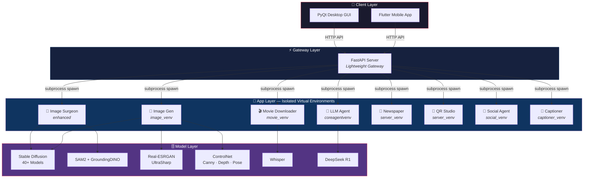
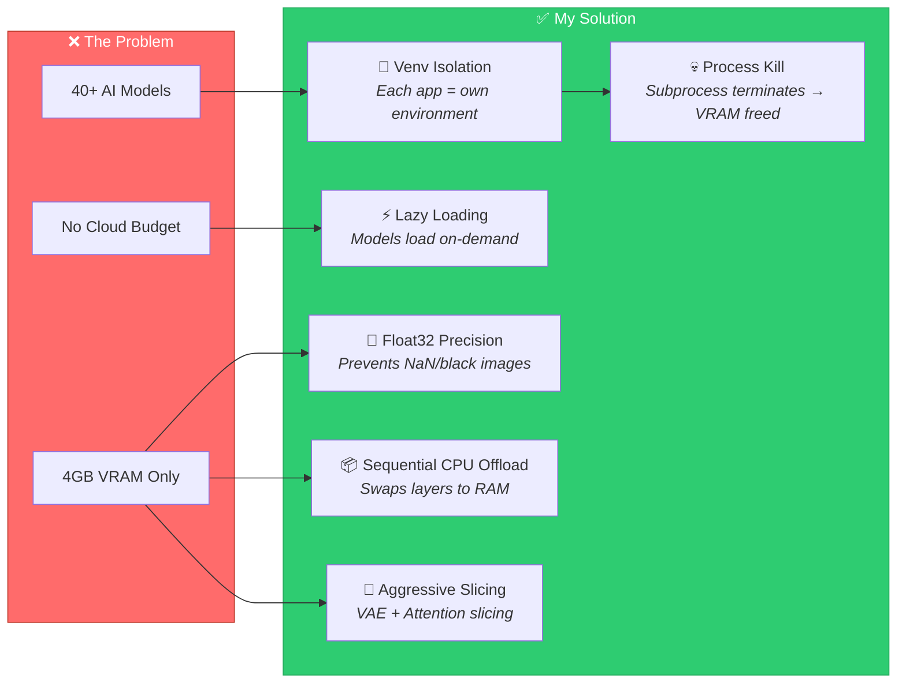
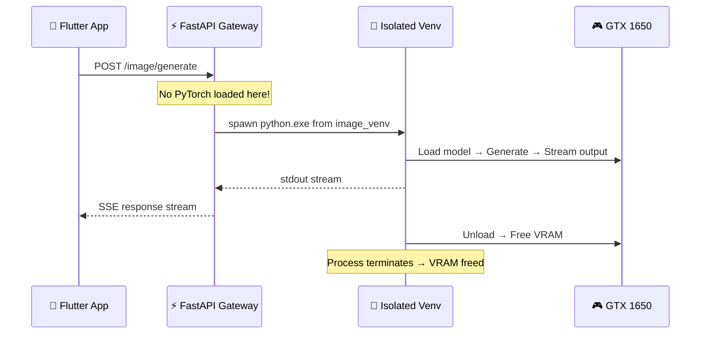

<div align="center">

# 🏰 NEURAL CITADEL

**A Multi-Agent AI Platform — Built From Scratch on a GTX 1650**

[](LICENSE)
[](https://python.org)
[](https://flutter.dev)
[](https://www.riverbankcomputing.com/software/pyqt/)
[](https://fastapi.tiangolo.com)

---

*I built this entire system to run 40+ AI models on a single GPU with just 4GB of VRAM.*
*No cloud. No expensive hardware. Just engineering.*

</div>

---

## 🧠 What Is Neural Citadel?

Neural Citadel is my personal AI platform — a monorepo containing **12 independent apps**, a **FastAPI gateway server**, a **PyQt desktop GUI**, and a **Flutter mobile app** — all engineered to run on consumer-grade hardware.

I designed every pipeline, every optimization, and every architecture decision from scratch. The core challenge I solved: **running Stable Diffusion, LLMs, SAM2, ControlNet, Whisper, Real-ESRGAN, and dozens of other models on a GTX 1650 with 4GB VRAM** — without crashing, without black images, without compromise.

---

## ⚡ The 12 Apps

| # | App | What I Built |
|:-:|-----|-------------|
| 🎨 | **Image Gen** | Stable Diffusion pipeline with 40+ models, 13 art styles, 6 schedulers, 5 upscalers, 3 ControlNets, and a CivitAI prompt learner |
| 🔪 | **Image Surgeon** | AI background replacement + virtual clothes try-on using GroundingDINO, SAM2, SegFormer, and CatVTON |
| 🎬 | **Movie Downloader** | YouTube downloads, multi-source torrent search, TMDB trending, Whisper transcription, and virus scanning |
| 📰 | **Newspaper Publisher** | RSS aggregation from 135+ feeds → premium magazine-quality PDFs with 18+ cover styles (Vogue, GQ, Elle, etc.) |
| 📱 | **QR Studio** | 61-type QR code generator with gradients, SVG output, logo embedding, and custom module drawers |
| 🤖 | **LLM Agent** | Local LLM chat with DeepSeek reasoning, coding mode, and hacking mode |
| 🧩 | **Core Agent** | Central reasoning engine powering all AI interactions |
| 📸 | **Image Captioner** | AI-powered image captioning and description generation |
| 📲 | **Social Automation** | Automated social media content creation — reels, stories, scheduling, and posting |
| 📊 | **Social Management** | Story builder with 14 narrative styles, voice generation, and content pipeline |
| 🌐 | **Socials Agent** | Reel builder with music selection, voiceover, and automated publishing |
| 📱 | **Mobile Citadel** | Flutter mobile app — thin client for the entire platform |

---

## 🏗️ System Architecture



---

## 🔧 How I Solved the 4GB VRAM Problem

Running AI models on a GTX 1650 is like parking a Boeing 747 in a garage. Here's how I made it work:



| Technique | What I Did | Why |
|-----------|-----------|-----|
| **Float32** | Forced float32 instead of float16 | GTX 1650 produces NaN values with float16 → black images |
| **Sequential CPU Offload** | Models swap layers between GPU and RAM mid-inference | Fits 2GB+ models in 4GB VRAM |
| **VAE Slicing** | Process VAE in chunks instead of all at once | Reduces peak VRAM by ~40% |
| **Attention Slicing** | `slice_size="max"` for maximum memory savings | Trades speed for stability |
| **Subprocess Architecture** | Each app runs as an isolated subprocess | When subprocess dies, VRAM is 100% freed. No leaks. |
| **Lazy Loading** | Models only load when a user requests that specific feature | No wasted VRAM on idle features |

---

## 📂 Project Structure

```
neural_citadel/
├── apps/                          # 12 independent app modules
│   ├── image_gen/                 # 🎨 Stable Diffusion pipeline (40+ models)
│   ├── image_surgeon/             # 🔪 Background replacement + clothes try-on
│   ├── movie_downloader/          # 🎬 YouTube + torrents + transcription
│   ├── newspaper_publisher/       # 📰 RSS → premium PDF magazines
│   ├── qr_studio/                 # 📱 61-type QR code generator
│   ├── llm_agent/                 # 🤖 Local LLM reasoning + coding
│   ├── core_agent/                # 🧩 Central reasoning engine
│   ├── image_captioner/           # 📸 AI image captioning
│   ├── social_automation_agent/   # 📲 Automated social content
│   ├── social_management_agent/   # 📊 Story builder + voice gen
│   ├── socials_agent/             # 🌐 Reel builder + publishing
│   └── mobile_citadel/            # 📱 Flutter mobile app
│
├── infra/                         # Infrastructure
│   ├── server/                    # FastAPI gateway (lightweight)
│   ├── gui/                       # PyQt desktop GUI
│   └── standalone/                # Standalone engine scripts
│
├── tools/                         # CLI utilities + scrapers
├── configs/                       # Centralized configuration
├── docs/                          # Full documentation
├── tests/                         # Test files + engine testing
├── assets/                        # Models, prompts, generated content
│   ├── exe/                       # Binary tools (aria2c)
│   └── apps_assets/               # App-specific assets
└── experiments/                   # R&D experiments
```

---

## 🔌 Server Architecture

I designed the server as a **Lightweight Gateway** — it never loads heavy AI libraries itself. Instead, it spawns isolated subprocesses, each in its own virtual environment:



| Component | Virtual Environment | Mode |
|-----------|-------------------|------|
| **Gateway** | `server_venv` | Persistent (lightweight) |
| **Image Gen** | `image_venv` | On-Demand |
| **Image Surgeon** | `enhanced` | On-Demand |
| **Movie Downloader** | `movie_venv` | On-Demand |
| **LLM / Reasoning** | `coreagentvenv` | On-Demand |
| **QR Studio** | `server_venv` | On-Demand |
| **Newspaper** | `server_venv` | On-Demand |

---

## 🎨 Image Generation Pipeline

My image generation system supports **13 art styles** with **40+ model variants**:

| Style | Models | Features |
|-------|--------|----------|
| **Anime** | MeinaMix, BloodOrangeMix, AbyssOrangeMix, +4 more | LoRA support, style-specific prompts |
| **Hyperrealistic** | Realistic Vision, DreamShaper, NeverEnding, +2 more | CivitAI prompt learning |
| **Horror** | Auto-detect shot type from prompt | Scene-aware composition |
| **Cars** | 11 LoRA variants (F1, RX7, Speedtail, etc.) | Auto-style detection |
| **Drawing** | Rachel Walker, Matcha Pixiv, Chinese Ink, +1 more | Art-style faithful |
| **Zombie** | Auto-detect from prompt keywords | Close-up / wide / horde |
| **Ghost** | Ethereal spectral rendering | Translucency effects |
| **Papercut** | Midjourney-style, Papercraft | Layered paper art |
| **Space** | Nebula-optimized | Cosmic rendering |
| **And more...** | Ethnicity, NSFW, DifConsistency, DiffusionBrush | Specialized pipelines |

---

## 🛠️ Tech Stack

| Layer | Technology |
|-------|-----------|
| **AI/ML** | PyTorch, Diffusers, Transformers, Real-ESRGAN, SAM2, ControlNet, Whisper |
| **Backend** | FastAPI, Python 3.10+, asyncio subprocess management |
| **Desktop** | PyQt5/6 with custom cyberpunk theming |
| **Mobile** | Flutter + Dart (thin HTTP client) |
| **PDF Gen** | ReportLab (magazine-quality layouts) |
| **Scraping** | yt-dlp, feedparser, CivitAI API, TMDB API |
| **Security** | ClamAV/VirusTotal scanning, strict venv isolation |

---

## ⚠️ License

**This project is NOT open source.**

I'm sharing the code publicly for **portfolio and demonstration purposes only**. You may view the code, but you may **not** use, copy, modify, distribute, or create derivative works from it without my explicit written permission.

See [`LICENSE`](LICENSE) for the full terms.

---

<div align="center">

**Built with obsession by [Raj Tewari](https://github.com/RajTewari01)**

*Every pipeline. Every optimization. Every architecture decision. Mine.*

</div>
