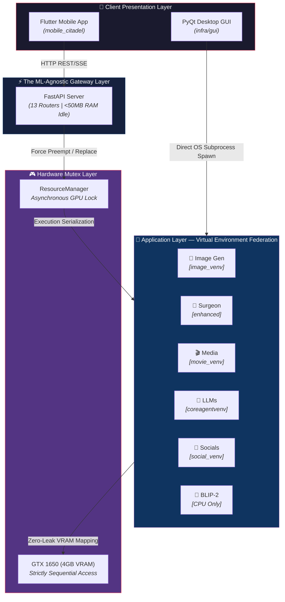

# 🏰 NEURAL CITADEL
**Efficient Multi-Model AI Serving on Consumer GPUs via Subprocess Isolation**

---

*A monolithic, environment-federated AI serving platform designed specifically for constrained edge environments. Neural Citadel orchestrates 40+ heterogeneous models (vision, reasoning, audio, media) with mathematically guaranteed zero-leak VRAM reclamation.*

---

## 🔬 Systems Architecture Overview

Neural Citadel explicitly rejects the conventional paradigms of in-process model swapping (`del model; torch.cuda.empty_cache()`), which inevitably fall victim to long-tail CUDA memory fragmentation and Ghost States on low-VRAM hardware. 

Instead, it introduces a **Subprocess Isolation Architecture** utilizing a strict, centralized GPU mutex (`ResourceManager`). By delegating all heavy machine learning execution to isolated Python subprocesses with per-application virtual environments and dual-mode Inter-Process Communication (IPC), the system provides absolute 100% VRAM release upon process termination. 

### The Dual-Client Bridge Pattern

The system serves both a native desktop client and a complex mobile application from the *same* underlying AI engine wrappers, without code duplication.

---

## ⚡ The 12 Application Engines

Neural Citadel houses 12 independent backend pipelines, safely partitioned via Virtual Environment Federation to resolve the impossible dependency conflicts between 8 different ML framework generations (e.g. legacy `detectron2` vs modern `diffusers`).

| Domain | Pipeline Engine | Internal Architecture |
|:---|:---|:---|
| **Vision** | 🎨 **Image Gen** | 478-line DiffusionEngine auto-routing 40+ models, 14 pipelines, 6 schedulers, and 3 ControlNets. |
| **Vision** | 🔪 **Image Surgeon** | 6-stage background/clothes swap chaining SAM2, GroundingDINO, SegFormer, and CatVTON. |
| **Parsing** | 📸 **Captioner** | BLIP-2 vision-language model pinned explicitly to CPU threads to avoid GPU mutex contention. |
| **Logic** | 🤖 **LLM Agent** | Persistent stdin/stdout pipelines mapped to DeepSeek-R1 (CoT streaming), DeepSeek/Qwen Coder, and LLaMA 3.1. |
| **Media** | 🎬 **Downloader** | Multi-source torrent/YouTube ingest, Whisper subtitle generation, and ClamAV auto-virus scanning. |
| **Agents** | 📲 **Social Automation** | End-to-end Reels/Stories creation, dynamic scheduling, and auto-commenting via Selenium and API dual-backends. |
| **Print** | 📰 **News Publisher** | RSS aggregation (135+ feeds) → SSR → ReportLab PDF typesetting across 18+ high-end magazine styles. |
| **Utility** | 📱 **QR Studio** | 374-type algorithmic QR generator with Stable Diffusion ControlNet artistic integration via a `ThreadPoolExecutor`. |

---

## 📱 Mobile Citadel: The Frontend Anomaly

The Flutter client (`apps/mobile_citadel`) is not a thin API consumer. It is a strictly proprietary, highly localized system executing massive system-level integrations to offload work from the FastAPI server:

*   **System-Level Dynamic Island**: A 605-line Dart Isolate (`neural_pulse_overlay.dart`) that persists across the OS, executing 60fps glassmorphic waveform generation and native bidirectional `MethodChannel` data sharing.
*   **Default Dialer Replacement**: 2,500+ lines of raw Android interception logic acting as the dominant telephony handler, featuring ghost-call prevention and T9 contacts syncing.
*   **34+ Physics Renderers**: Hardware-accelerated `.dart` algorithms rendering Keplerian black holes, raycast asteroid collisions, and autonomous AI-steered rocket geometries perfectly at 60 Frames Per Second locally.
*   **Offline Voice Commander**: "Hey Neural" intent bridging with hard-reset STT recovery loops and a 150+ offline app registry.

---

## 🧠 VRAM Compression & Optimization Math

Running state-of-the-art architectures on a TU117 (GTX 1650) mandates extreme optimization:

1. **Subprocess Kill-and-Replace**: Context switching from LLM to Image Generation triggers a forced OS-level `SIGKILL` if the process doesn't gracefully exit in 2.0s. This achieves a provable baseline VRAM drop to 0GB, eliminating continuous fragmentation.
2. **FP32 Turing Stabilization**: Empirical architecture testing proved FP16 precision triggers `NaN` cascades in the VAE decoder on this specific hardware. We force Float32 execution logic.
3. **Aggressive CPU Offloading**: To prevent the 6.8GB FP32 requirement from triggering an `OOM` fault, Neural Citadel chains `enable_sequential_cpu_offload()`, `enable_vae_slicing()`, and `enable_attention_slicing("max")`—compressing the execution pipeline to just **1.8GB** at the cost of latency.

---

## ⚠️ Proprietary License & Usage Restrictions

**This codebase and its localized architecture are strictly PROPRIETARY. This is NOT open-source software.**

This repository serves strictly as a professional portfolio artifact demonstrating high-tier edge systems engineering, VRAM optimization, and multi-agent orchestration.

**Under no circumstances may you:**
*   Run, build, clone, or execute this software in any environment.
*   Extract the Application architectures, Python wrappers, or Dart rendering mechanisms for derivative works.
*   Utilize this codebase as training data for Language Models or code-generation entities.
*   Attempt to reverse-engineer the IPC standard I/O bridging protocols or the ResourceManager Mutex locking patterns.

See the [`LICENSE`](LICENSE) strictly enforced in the root directory.

---

<b>Architected, Designed, and Authored by Biswadeep Tewari</b> 
<i>Every pipeline orchestrated. Every byte of VRAM defended.</i>

