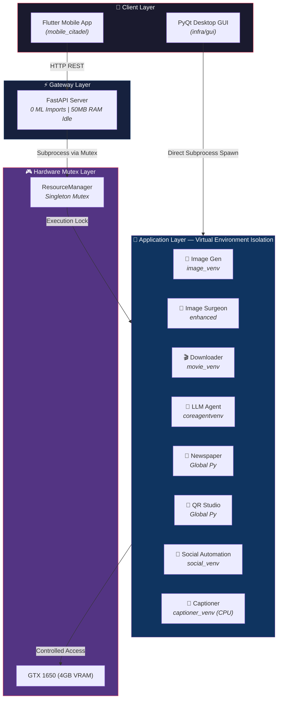
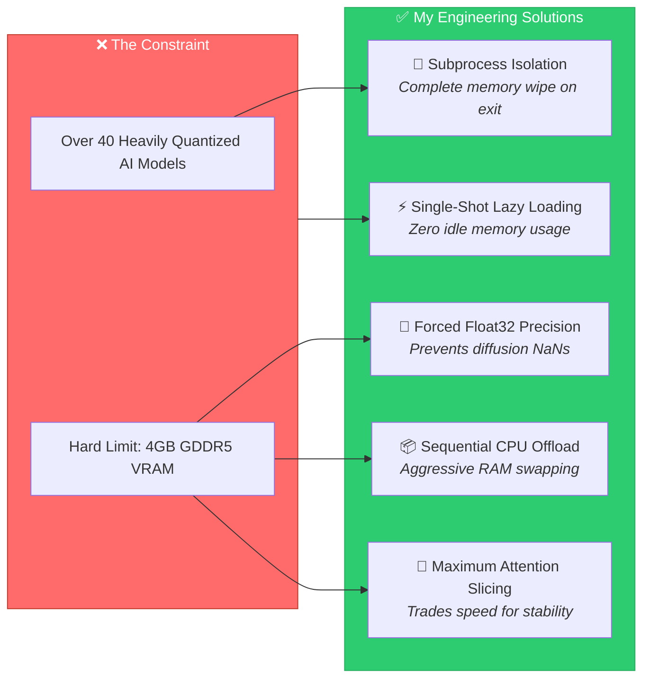

<div align="center">

# 🏰 NEURAL CITADEL

**A Multi-Agent AI Platform — Built From Scratch on a GTX 1650**

[](LICENSE)
[](https://python.org)
[](https://flutter.dev)
[](https://fastapi.tiangolo.com)

---

*I built this entire system to run 40+ complex AI models reliably on a single $150 GPU with just 4GB of VRAM.*
*No cloud dependencies. No expensive server racks. Just pure engineering.*

</div>

---

## 🧠 What Is Neural Citadel?

Neural Citadel is my personal, proprietary AI platform. It's a massive monorepo containing **12 independent backend applications**, an ultra-lightweight **FastAPI gateway server**, a native **PyQt desktop GUI**, and a beautifully animated **Flutter mobile app**—all engineered to run locally on severely constrained consumer-grade hardware.

I designed every pipeline, every VRAM optimization, and every overarching architecture decision entirely from scratch. The core engineering challenge I set out to solve: **running Stable Diffusion, large language models, SAM2, ControlNet, Whisper, Real-ESRGAN, and dozens of other heavy models on a GTX 1650 with 4GB VRAM** without the system crashing or yielding black images.

---

## ⚡ The 12 Applications I Built

| App | What It Does Under the Hood |
|-----|-------------|
| 🎨 **Image Gen** | My custom Stable Diffusion pipeline auto-routing 40+ models, 13 art styles, 6 schedulers, 5 upscalers, and 3 ControlNets. |
| 🔪 **Image Surgeon** | An advanced AI background replacement and virtual clothes try-on engine chaining GroundingDINO, SAM2, SegFormer, and CatVTON. |
| 🎬 **Movie Downloader** | A massive acquisition pipeline handling YouTube, multi-source torrent searches, TMDB trending, Whisper transcriptions, and ClamAV auto-virus scanning. |
| 📰 **Newspaper Publisher** | An aggregator pulling from 135+ RSS feeds to automatically typeset premium magazine-quality PDFs across 18+ cover styles (like Vogue or GQ). |
| 📱 **QR Studio** | A 374-type QR code generator with gradients, dynamic SVG outputs, logo embeddings, and AI-diffusion artistic codes. |
| 🤖 **LLM Agent** | A local LLM chat interface hooked into DeepSeek reasoning, optimized coding modes, and dedicated cybersecurity/hacking personas. |
| 🧩 **Core Agent** | The central reasoning engine powering cognitive tasks across the entire platform. |
| 📸 **Image Captioner** | A standalone BLIP-2 vision-language model I run on CPU-only mode for detailed image captioning without starving my GPU. |
| 📲 **Social Automation** | My automated content creation engine that handles reels, stories, scriptwriting, dynamic scheduling, and automated posting. |
| 📊 **Social Management** | A story builder utilizing 14 narrative frameworks with specialized voice generation. |
| 🌐 **Socials Agent** | My reel builder that intelligently pairs visuals with background music, dynamic subtitles, and AI voiceovers. |
| 📱 **Mobile Citadel** | The crown jewel Flutter client. It features a system-level Dynamic Island overlay, a native phone dialer replacement, a custom voice commander, and 34+ distinct 60fps physics/rendering effects entirely built by me. |

---

## 🏗️ System Architecture

I designed the system to enforce strict hardware isolation, allowing my mobile and desktop clients to share the same underlying intelligence without conflict.



---

## 🔧 How I Conquered the 4GB VRAM Limit

Running this many AI models sequentially on a GTX 1650 is a nightmare of memory management. Here is the strict ruleset I engineered to keep the platform stable indefinitely:



### The Subprocess Zero-Leak Guarantee
Instead of swapping models in a single Python script (which inevitably leaks hundreds of megabytes over time), my `ResourceManager` forces a strict **kill-and-replace** policy. Every application runs completely contained within its own virtual environment process. When I switch from generating an image to asking the LLM a question, the image process is violently killed by the OS. This mechanism is the only way to guarantee exactly **0 bytes** of leaked VRAM between context switches.

---

## 📂 Project Structure

```text
neural_citadel/
├── apps/                          # My 12 independent backend application modules
│   ├── image_gen/                 # 🎨 SD pipeline with prompt enhancement
│   ├── image_surgeon/             # 🔪 Background swap + CatVTON clothes
│   ├── movie_downloader/          # 🎬 360-degree media acquisition
│   ├── newspaper_publisher/       # 📰 SSR → PDF typesetter
│   ├── qr_studio/                 # 📱 370+ handler QR generator
│   ├── llm_agent/                 # 🤖 Llama-cpp wrappers
│   ├── core_agent/                # 🧩 Orchestration brain
│   ├── image_captioner/           # 📸 BLIP-2 CPU runner
│   ├── social_automation_agent/   # 📲 Automated Reels/Stories
│   ├── social_management_agent/   # 📊 Campaign logic
│   ├── socials_agent/             # 🌐 Publishing engine
│   └── mobile_citadel/            #📱 Massive Flutter client with Dynamic Island
│
├── infra/                         # Core Infrastructure
│   ├── server/                    # My ultra-lightweight FastAPI gateway
│   ├── gui/                       # The PyQt desktop client
│   └── standalone/                # Base engine scripts (called by both clients)
│
├── configs/                       # Global configs & secure env variables
├── docs/                          # Extensive documentation & papers
└── assets/                        # Model weights, logs, and generated artifacts
```

---

## ⚠️ Proprietary License & Strict Usage Rules

**This code is strictly PROPRIETARY. It is NOT open source.**

This repository exists publicly **solely as a demonstration of my engineering capabilities and to act as my professional portfolio**. 

You are strictly prohibited from:
- Running, using, executing, or deploying this software in any environment.
- Copying, modifying, or creating derivative works from my logic or architecture.
- Using this codebase or any part of it to train machine learning models or language agents.
- Ripping my backend architecture or UI designs for your own projects.

Please see the [`LICENSE`](LICENSE) file for the full legal terms.

---

<div align="center">

**Architected, Designed, and Built by Biswadeep Tewari**

*Every pipeline perfectly tuned. Every byte of VRAM defended. Every component mine.*

</div>
