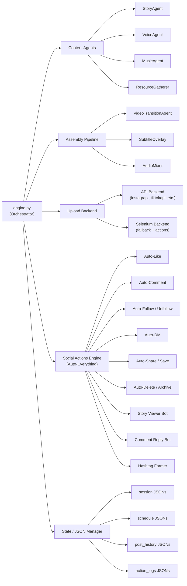
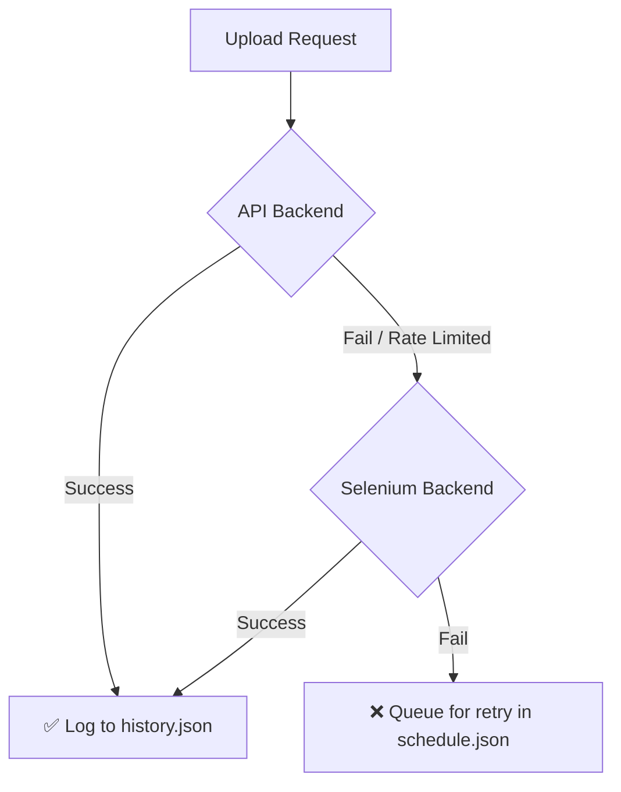
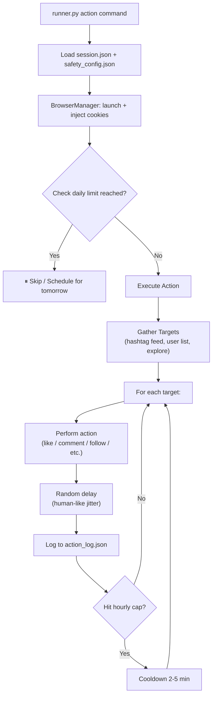
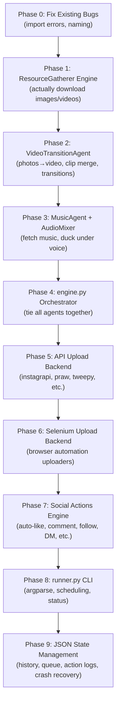

# Social Automation Agent — Master Architecture Plan
> **Last Updated:** Feb 2026  
> **Status:** Planning Phase  

---

## 1. High-Level Vision

A fully autonomous pipeline that:
1. **Generates** content (story, voiceover, visuals, music)
2. **Assembles** it into platform-ready reels/shorts
3. **Uploads** to multiple social platforms (dual backend: API + Selenium fallback)
4. **Engages** automatically — auto-comment, auto-like, auto-follow, auto-DM, auto-everything
5. **Manages** sessions, schedules, cleanup, and engagement — all with JSON state backups



---

## 2. Reel Types (4 Core Formats)

Each reel type is a **registered pipeline** via `registry.py`. The `engine.py` selects the right one based on user command or keyword matching.

### Type 1: Story Narration Reel
> Reddit stories, horror tales, motivational monologues

| Step | Agent | Output |
|---|---|---|
| 1. Generate script | `StoryAgent` | `{title, story}` |
| 2. Generate voiceover | `VoiceAgent` | `.wav` file |
| 3. Fetch background footage | `ResourceGatherer` → videos | Downloaded clips |
| 4. Assemble | `VideoTransitionAgent` | 9:16 reel with subtitle overlay |
| 5. Add background music | `MusicAgent` → `AudioMixer` | Ducked music under voice |

### Type 2: Photo Slideshow Reel
> Cars, travel, aesthetic compilations

| Step | Agent | Output |
|---|---|---|
| 1. Pick topic / random from JSON | Config | search term |
| 2. Fetch images | `ResourceGatherer` → images | Downloaded photos |
| 3. Ken Burns / zoom-pan | `VideoTransitionAgent` | Animated photo sequence |
| 4. Add music | `MusicAgent` | Background track |
| 5. Add text overlays | `VideoTransitionAgent` | Captions / watermarks |

### Type 3: Compilation / Montage Reel
> Memes, top-5 lists, before/after

| Step | Agent | Output |
|---|---|---|
| 1. Fetch themed clips | `ResourceGatherer` → videos | Short clips |
| 2. Trim & order | `VideoTransitionAgent` | Sequenced clips |
| 3. Add transitions | `VideoTransitionAgent` | Glitch / crossfade / slide effects |
| 4. Voiceover (optional) | `VoiceAgent` | Narration |
| 5. Add music + SFX | `MusicAgent` | Final audio mix |

### Type 4: Text-on-Screen Reel
> Quotes, facts, hot takes, tweet screenshots

| Step | Agent | Output |
|---|---|---|
| 1. Generate or load text | `StoryAgent` or JSON file | Text content |
| 2. Render text frames | `VideoTransitionAgent` | Animated text cards |
| 3. Add background video/gradient | `ResourceGatherer` or generated | Visual backdrop |
| 4. Add music | `MusicAgent` | Mood-matched track |

---

## 3. Full File Structure (Target)

```
social_automation_agent/
│
├── engine.py                          # Main orchestrator: picks reel type, runs pipeline
├── runner.py                          # CLI entry point (argparse)
├── requirements.txt                   # All dependencies
├── README.md
│
├── json/                              # All JSON state/config/backup files
│   ├── discord/session.json
│   ├── facebook/session.json
│   ├── instagram/session.json
│   ├── reddit/session.json
│   ├── tiktok/session.json
│   ├── twitter/session.json
│   ├── youtube/session.json
│   ├── schedules/                     # [NEW] Scheduled post queue
│   │   └── queue.json
│   ├── post_history/                  # [NEW] What was posted where & when
│   │   └── history.json
│   └── search_terms/                  # [NEW] Topic banks for auto-generation
│       └── topics.json
│
├── reels_creator/
│   ├── __init__.py                    # [NEW] Package init
│   │
│   ├── agents/
│   │   ├── __init__.py
│   │   ├── base.py                    # ✅ ConfigPlatform (exists)
│   │   ├── story_agent.py             # ✅ StoryTellerAgent (exists)
│   │   ├── voice_agent.py             # ✅ VoiceOverAgent (exists)
│   │   ├── music_agent.py             # [BUILD] Background music fetcher/mixer
│   │   └── video_transition_agent.py  # [BUILD] FFmpeg/MoviePy video compositor
│   │
│   ├── resource_gatherer/
│   │   ├── __init__.py
│   │   ├── base.py                    # ✅ BaseGatherer + sanitizer (exists)
│   │   ├── registry.py                # ✅ Pipeline registry (exists)
│   │   ├── pipeline_types.py          # ✅ PipelineConfig dataclass (exists, needs fixes)
│   │   ├── engine.py                  # [BUILD] Actual download engine
│   │   ├── duckduckgo.py              # ⚠ Config shell (needs import fix)
│   │   ├── pixabay.py                 # ⚠ Config shell (needs import fix)
│   │   ├── pixabay_video.py           # ⚠ Config shell (needs import fix)
│   │   ├── pixels.py                  # ⚠ Config shell (needs import fix)
│   │   ├── pixels_video.py            # ⚠ Config shell (needs import fix)
│   │   ├── unsplash.py                # ⚠ Config shell (needs import fix)
│   │   └── giphy_video.py             # ⚠ Config shell (needs import fix)
│   │
│   └── helper_workers/
│       ├── __init__.py                # [NEW]
│       ├── offline_story_helper.py    # ✅ Mistral 7B story gen (exists)
│       ├── offline_voice_helper.py    # ✅ Sherpa-ONNX TTS (exists)
│       ├── audio_mixer.py             # [NEW] Voice + music mixing with ducking
│       ├── subtitle_renderer.py       # [NEW] Burn captions onto video
│       └── instruction/
│           └── instruction.md
│
└── selenium_backend/
    ├── __init__.py                    # [NEW]
    ├── pipeline_types.py              # ⚠ Empty dataclass (needs fields)
    ├── browser_manager.py             # [NEW] Selenium driver setup, anti-detect
    ├── session_manager.py             # [NEW] Load/save/rotate sessions from JSON
    ├── uploaders/                     # [NEW] Per-platform Selenium uploaders
    │   ├── __init__.py
    │   ├── instagram_uploader.py
    │   ├── tiktok_uploader.py
    │   ├── youtube_uploader.py
    │   ├── reddit_uploader.py
    │   ├── twitter_uploader.py
    │   ├── facebook_uploader.py
    │   └── discord_uploader.py
    │
    └── actions/                       # [NEW] Social engagement automation
        ├── __init__.py
        ├── base_action.py             # Base class: delays, logging, rate limits
        ├── auto_like.py               # Like posts by hashtag / feed / user
        ├── auto_comment.py            # Comment on posts (template + AI-gen)
        ├── auto_follow.py             # Follow users by hashtag / similar accounts
        ├── auto_unfollow.py           # Unfollow non-followers / old follows
        ├── auto_dm.py                 # Send DMs to new followers / targets
        ├── auto_share.py              # Share / repost content
        ├── auto_save.py               # Save / bookmark posts
        ├── auto_delete.py             # Delete old posts / archive them
        ├── auto_block_mute.py         # Block / mute spam accounts
        ├── story_viewer.py            # Mass-view stories for visibility
        ├── comment_reply_bot.py       # Auto-reply to comments on your posts
        ├── hashtag_farmer.py          # Rotate hashtags, find trending ones
        └── engagement_scheduler.py    # Schedule all actions with jitter
```

---

## 4. Engine Architecture (`engine.py`)

The engine is the **brain**. It receives a command and orchestrates the full pipeline.

```python
# Pseudocode for engine.py flow

class SocialEngine:

    def run(self, reel_type, platform, topic=None, schedule=None):
        # Step 1: Generate content based on reel type
        content = self._generate_content(reel_type, topic)
        #   → returns {story, voice_path, images[], videos[], music_path}

        # Step 2: Assemble into final video
        final_video = self._assemble_reel(reel_type, content)
        #   → returns Path to final .mp4

        # Step 3: Upload (API first, Selenium fallback)
        result = self._upload(platform, final_video, content['caption'])

        # Step 4: Log to history JSON
        self._log_post(platform, result)

        # Step 5: Cleanup temp files
        self._cleanup(content)

    def _upload(self, platform, video, caption):
        try:
            return self.api_backend.upload(platform, video, caption)
        except APIFailure:
            return self.selenium_backend.upload(platform, video, caption)
```

---

## 5. Upload Backend — Dual Strategy

### 5A. API Backend (Primary — Fast, Reliable)

| Platform | Library / API | Notes |
|---|---|---|
| Instagram | `instagrapi` | Reel, Story, Post, Carousel. Best IG library. |
| TikTok | `TikTokApi` or `tiktok-uploader` | Unofficial but works. Session-based. |
| YouTube | `google-api-python-client` | Official OAuth2. YouTube Shorts = normal upload with `#Shorts`. |
| Reddit | `praw` | Official API. Post video/image to subreddit. |
| Twitter/X | `tweepy` v2 | Official API v2. Media upload + tweet. |
| Facebook | Graph API (`requests`) | Page posts. Needs page access token. |
| Discord | `discord.py` or webhook | Webhook is easiest for auto-posting to channels. |

### 5B. Selenium Backend (Uploads + Full Social Actions)

The Selenium backend does **two jobs**: fallback uploading AND full engagement automation.

```
selenium_backend/
├── browser_manager.py     → Launch headless Chrome, randomize fingerprint
├── session_manager.py     → Load cookies from session.json, validate, refresh
├── uploaders/             → Upload content when API fails
│   └── instagram_uploader.py  → Navigate to IG, click upload, select file...
└── actions/               → AUTO-EVERYTHING engagement engine
    ├── auto_like.py       → Heart posts by hashtag / feed / target users
    ├── auto_comment.py    → Drop comments (templates + AI-generated)
    ├── auto_follow.py     → Follow by hashtag / explore / similar accounts
    ├── auto_unfollow.py   → Unfollow non-followers / stale follows
    ├── auto_dm.py         → DM new followers / cold outreach
    ├── auto_share.py      → Share to story / repost
    ├── auto_save.py       → Bookmark posts for later
    ├── auto_delete.py     → Delete / archive old posts
    ├── auto_block_mute.py → Block bots, mute spam
    ├── story_viewer.py    → Mass-view stories to get noticed
    ├── comment_reply_bot.py → Auto-reply to comments on your posts
    └── hashtag_farmer.py  → Find trending hashtags, rotate sets
```

**Anti-detection measures:**
- Random delays between actions (`1-5s` jitter, configurable per-action)
- Rotate user agents (already have 30+ in `base.py`)
- Load cookies from `session.json` instead of logging in every time
- Headless + `undetected-chromedriver` or `seleniumbase`
- Daily action caps (configurable in JSON) to stay under platform limits
- Warm-up mode: start slow on new accounts, gradually increase activity
- Session cooldown: pause after N actions, resume after random delay

### 5C. Fallback Flow



---

### 5D. Social Actions Engine — Auto-Everything

This is the **engagement automation** side. Every action runs through Selenium (or API where available) with safety limits, logging, and JSON backups.

#### All Supported Actions

| Action | What it does | Targets | Platforms |
|---|---|---|---|
| **Auto-Like** | Like posts automatically | By hashtag, explore feed, specific users, your feed | IG, TikTok, Twitter, Reddit, FB, YT |
| **Auto-Comment** | Post comments on target content | By hashtag, specific posts, competitors' posts | IG, TikTok, Twitter, Reddit, FB, YT |
| **Auto-Follow** | Follow users to gain follow-backs | By hashtag, similar accounts, followers of competitors | IG, TikTok, Twitter, Reddit |
| **Auto-Unfollow** | Clean up following list | Non-followers, old follows (>7 days), inactive accounts | IG, TikTok, Twitter |
| **Auto-DM** | Send direct messages | New followers, target list, cold outreach | IG, Twitter, Discord |
| **Auto-Share** | Share/repost content | Own posts to stories, others' posts | IG, Twitter, FB |
| **Auto-Save** | Bookmark/save posts | By hashtag, competitor content | IG, Twitter, Reddit |
| **Auto-Delete** | Delete or archive old posts | Own posts older than X days, low-engagement posts | IG, TikTok, Twitter, Reddit, YT |
| **Auto-Block/Mute** | Block bots, mute spam | Spam commenters, bot followers, keyword triggers | All platforms |
| **Story Viewer** | Mass-view stories | Target users, hashtag followers, competitors' followers | IG |
| **Comment Reply Bot** | Auto-reply to comments on YOUR posts | All comments, keyword-triggered, thank-you replies | IG, TikTok, YT, Reddit |
| **Hashtag Farmer** | Find & rotate trending hashtags | By niche, by competitor analysis, trending | IG, TikTok, Twitter |

#### Action Architecture

Every action inherits from `BaseAction`:

```python
# Pseudocode for base_action.py

class BaseAction:
    def __init__(self, platform, session_json, action_config_json):
        self.browser = BrowserManager(session_json)  # Load cookies
        self.config = self._load_config(action_config_json)
        self.action_log = []  # Tracks everything done this session

    def _random_delay(self, min_s=1, max_s=5):
        """Human-like random wait between actions."""
        time.sleep(random.uniform(min_s, max_s))

    def _check_rate_limit(self, action_type):
        """Check if we've hit the daily/hourly cap for this action."""
        count = self._get_today_count(action_type)
        limit = self.config['daily_limits'][action_type]
        if limit != -1 and count >= limit:
            raise RateLimitReached(f"{action_type}: {count}/{limit}")

    def _log_action(self, action_type, target, result):
        """Log every action to JSON for audit trail."""
        entry = {
            "action": action_type,
            "target": target,
            "result": result,
            "timestamp": datetime.now().isoformat(),
            "platform": self.platform
        }
        self.action_log.append(entry)
        self._save_to_json(entry)

    def execute(self):
        raise NotImplementedError
```

#### Comment Generation Strategies

`auto_comment.py` supports multiple comment sources:

| Strategy | How it works |
|---|---|
| **Template Pool** | Pick from a JSON list of pre-written comments per niche |
| **AI-Generated** | Use `StoryAgent` / local LLM to generate contextual comments based on post caption |
| **Emoji-Only** | Random emoji combos (🔥💯, ❤️😍, etc.) for low-risk engagement |
| **Question Mode** | Ask a question related to the post to boost engagement |
| **Compliment Mode** | Generic compliments that work on any post |

#### Comment Templates JSON (`json/actions/comment_templates.json`)
```json
{
  "niches": {
    "fitness": [
      "This is insane motivation 💪🔥",
      "How long did it take you to get here?",
      "Absolutely crushing it!",
      "What's your routine looking like?"
    ],
    "cars": [
      "That's a beast 🔥",
      "What's the 0-60 on this?",
      "Clean build!",
      "The color is perfect 😍"
    ],
    "horror": [
      "This gave me chills",
      "I couldn't stop reading",
      "Part 2 when??",
      "This is why I don't sleep"
    ],
    "generic": [
      "Love this ❤️",
      "Amazing content! 🔥",
      "This is fire 💯",
      "Keep going! 🙌"
    ]
  }
}
```

#### Safety Config (`json/actions/safety_config.json`)

Per-platform daily/hourly limits to avoid bans:

```json
{
  "instagram": {
    "daily_limits": {
      "likes": 150,
      "comments": 40,
      "follows": 60,
      "unfollows": 60,
      "dms": 20,
      "story_views": 200,
      "shares": 30,
      "saves": 50,
      "blocks": 30
    },
    "hourly_limits": {
      "likes": 25,
      "comments": 8,
      "follows": 12,
      "unfollows": 12,
      "dms": 5
    },
    "delays": {
      "between_likes_sec": [2, 6],
      "between_comments_sec": [15, 45],
      "between_follows_sec": [10, 30],
      "between_dms_sec": [30, 90],
      "cooldown_after_n_actions": 30,
      "cooldown_duration_sec": [120, 300]
    },
    "warmup": {
      "enabled": true,
      "day_1_multiplier": 0.2,
      "day_7_multiplier": 0.5,
      "full_speed_after_days": 14
    }
  },
  "tiktok": {
    "daily_limits": {
      "likes": 200,
      "comments": 50,
      "follows": 80,
      "unfollows": 80,
      "shares": 50
    },
    "delays": {
      "between_likes_sec": [1, 4],
      "between_comments_sec": [10, 30],
      "between_follows_sec": [8, 25]
    }
  },
  "twitter": {
    "daily_limits": {
      "likes": 300,
      "comments": 100,
      "follows": 100,
      "unfollows": 100,
      "dms": 30,
      "retweets": 100
    },
    "delays": {
      "between_likes_sec": [1, 3],
      "between_comments_sec": [5, 20],
      "between_follows_sec": [5, 15]
    }
  },
  "reddit": {
    "daily_limits": {
      "upvotes": 100,
      "comments": 30,
      "posts": 5
    },
    "delays": {
      "between_votes_sec": [3, 10],
      "between_comments_sec": [30, 120]
    }
  },
  "youtube": {
    "daily_limits": {
      "likes": 200,
      "comments": 50,
      "subscribes": 40
    },
    "delays": {
      "between_likes_sec": [2, 5],
      "between_comments_sec": [15, 45]
    }
  }
}
```

#### Action Flow



---

## 6. JSON Backup Strategy

Every state-changing action writes to JSON. If the process crashes mid-pipeline, you can resume.

### 6A. Session JSONs (`json/<platform>/session.json`)
Already templated. Store:
- Auth tokens / cookies
- Device fingerprint
- Rate limit counters
- Permissions map

### 6B. Post History (`json/post_history/history.json`)
```json
{
  "posts": [
    {
      "id": "post_20260224_001",
      "platform": "instagram",
      "reel_type": "story_narration",
      "topic": "haunted basement",
      "file_path": "output/reel_001.mp4",
      "caption": "This happened to me last week...",
      "hashtags": ["#nosleep", "#horror", "#reddit"],
      "posted_at": "2026-02-24T22:00:00+05:30",
      "status": "posted",
      "backend_used": "api",
      "engagement": {
        "views": null,
        "likes": null,
        "comments": null
      }
    }
  ]
}
```

### 6C. Schedule Queue (`json/schedules/queue.json`)
```json
{
  "queue": [
    {
      "id": "sched_001",
      "reel_type": "photo_slideshow",
      "platform": ["instagram", "tiktok"],
      "topic": "luxury cars",
      "scheduled_time": "2026-02-25T18:00:00+05:30",
      "status": "pending",
      "retry_count": 0
    }
  ]
}
```

### 6D. Pipeline State (`json/pipeline_state.json`) — Crash Recovery
```json
{
  "current_job": {
    "id": "job_abc123",
    "reel_type": "story_narration",
    "stage": "voice_generation",
    "completed_stages": ["story_generation"],
    "artifacts": {
      "story": {"title": "...", "body": "..."},
      "voice_path": null,
      "video_path": null
    },
    "started_at": "2026-02-24T22:30:00+05:30"
  }
}
```

### 6E. Action Logs (`json/actions/action_log.json`) — Engagement Audit Trail

Every auto-like, auto-comment, auto-follow, etc. gets logged here:

```json
{
  "actions": [
    {
      "id": "act_001",
      "action": "auto_like",
      "platform": "instagram",
      "target": {"post_id": "CxYz123", "user": "@somepage"},
      "result": "success",
      "timestamp": "2026-02-24T23:05:12+05:30"
    },
    {
      "id": "act_002",
      "action": "auto_comment",
      "platform": "instagram",
      "target": {"post_id": "CxYz456", "user": "@another"},
      "comment_text": "This is fire 💯",
      "strategy": "template_pool",
      "result": "success",
      "timestamp": "2026-02-24T23:05:45+05:30"
    },
    {
      "id": "act_003",
      "action": "auto_follow",
      "platform": "tiktok",
      "target": {"user": "@creator123"},
      "source": "hashtag:horror",
      "result": "success",
      "timestamp": "2026-02-24T23:06:30+05:30"
    }
  ]
}
```

### 6F. Follow Tracker (`json/actions/follow_tracker.json`) — For Auto-Unfollow

Tracks who you followed and when, so auto-unfollow knows who to drop:

```json
{
  "instagram": {
    "following": [
      {
        "user": "@user1",
        "followed_at": "2026-02-20T10:00:00+05:30",
        "followed_back": false,
        "source": "hashtag:fitness"
      },
      {
        "user": "@user2",
        "followed_at": "2026-02-18T14:00:00+05:30",
        "followed_back": true,
        "source": "competitor:@bigpage"
      }
    ]
  }
}
```

### 6G. DM Templates (`json/actions/dm_templates.json`)

```json
{
  "new_follower": [
    "Hey! Thanks for following 🙌 What content do you want to see more of?",
    "Welcome! Glad to have you here 🔥",
    "Thanks for the follow! Check out our latest reel 👀"
  ],
  "cold_outreach": [
    "Hey! Love your content. Would you be down to collab?",
    "Your page is insane 🔥 Let's connect!"
  ],
  "promo": [
    "Hey! Just dropped something crazy on my page, check it out 👀"
  ]
}

---

## 7. Agents — What Each One Needs To Do

### 7A. `MusicAgent` — What to build

| Feature | Implementation |
|---|---|
| Fetch royalty-free tracks | Pixabay Audio API, Freesound API, or local library |
| Mood matching | Map story tone → music tags (e.g., "horror" → "dark ambient") |
| Audio ducking | Lower music volume when voice is speaking |
| Loop/trim to video length | FFmpeg or pydub |
| Output | `.mp3` or `.wav` path |

### 7B. `VideoTransitionAgent` — What to build

| Feature | Implementation |
|---|---|
| Photo → video (Ken Burns) | FFmpeg `zoompan` filter or MoviePy |
| Clip merging | FFmpeg `concat` demuxer |
| Transitions | Crossfade, glitch, slide, fade-black, zoom-in |
| Aspect ratio | Force 9:16 (1080×1920) for reels |
| Subtitle burn | FFmpeg `drawtext` or ASS subtitles |
| Text cards | PIL/Pillow → render text frames → FFmpeg |
| Watermark | Semi-transparent logo overlay |
| Output | `.mp4` (H.264, AAC) |

**Recommended tool:** FFmpeg via subprocess (maximum control) with Python wrappers for convenience.

### 7C. `ResourceGatherer/engine.py` — What to build

The download engine that consumes `PipelineConfig` objects:

```
1. Accept PipelineConfig   → search_term, download_type, item_count, output_dir
2. Select source           → Based on registered pipeline or round-robin
3. Call API                 → Pixabay / Pexels / Unsplash / DuckDuckGo / Giphy
4. Download files           → async/threaded for speed
5. Validate                 → Check file size, format, resolution
6. Return                   → List[Path] of downloaded files
```

**API keys** needed in `configs/secrets/socials.env`:
- `PIXABAY_API_KEY`
- `PEXELS_API_KEY`
- `UNSPLASH_ACCESS_KEY`
- `GIPHY_API_KEY`

---

## 8. `runner.py` — CLI Commands

**Content & Upload:**
```
python runner.py generate --type story_narration --topic "haunted house"
python runner.py generate --type photo_slideshow --topic "supercars"
python runner.py upload --file output/reel.mp4 --platform instagram tiktok
python runner.py auto --type story_narration --platform instagram --count 3
python runner.py schedule --type compilation --platform youtube --time "18:00"
```

**Social Actions (Auto-Everything):**
```
python runner.py like --platform instagram --hashtag "horror" --count 50
python runner.py comment --platform instagram --hashtag "fitness" --strategy template
python runner.py comment --platform tiktok --hashtag "cars" --strategy ai
python runner.py follow --platform instagram --source hashtag:horror --count 30
python runner.py unfollow --platform instagram --filter non_followers --older-than 7d
python runner.py dm --platform instagram --target new_followers --template welcome
python runner.py view-stories --platform instagram --source hashtag:nosleep --count 100
python runner.py reply-comments --platform instagram --mode thank_you
python runner.py farm-hashtags --platform instagram --niche horror --count 30
python runner.py delete-posts --platform instagram --older-than 30d --low-engagement
python runner.py block-bots --platform instagram --filter no_profile_pic
```

**Management:**
```
python runner.py status                    # Show queue, history, active jobs
python runner.py action-stats              # Show today's action counts vs limits
python runner.py cleanup --older-than 7d   # Delete temp files older than 7 days
python runner.py export-logs               # Export action logs to CSV
```

---

## 9. Known Bugs to Fix First

Before building new features, fix these in existing code:

| # | File | Bug | Fix |
|---|---|---|---|
| 1 | All 7 resource gatherer factories | Import `PipelineConfigs` (plural) | Change to `PipelineConfig` (singular) |
| 2 | All 7 resource gatherer factories | Pass `cleanup_photos` field | Remove it or add field to dataclass |
| 3 | All 7 resource gatherer factories | Docstring says "DuckDuckGo" | Fix to actual provider name |
| 4 | `pixabay.py` ↔ `pixabay_video.py` | Function names swapped | Swap them back |
| 5 | `pipeline_types.py` L124 | Instantiates `BaseGatherer()` for static method | Use `BaseGatherer.sanitize_search_term(term)` |
| 6 | `story_agent.py` L85 | Returns bare `None` instead of `(None, None)` | Return `(None, None)` |
| 7 | Missing `__init__.py` | `reels_creator/`, `helper_workers/`, `selenium_backend/` | Create empty `__init__.py` files |

---

## 10. Build Order (Suggested Priority)



---

## 11. Dependencies You'll Need

```
# Content Generation
llama-cpp-python          # Already using — Mistral 7B for stories
sherpa-onnx               # Already using — Piper VITS TTS

# Video / Audio Processing
moviepy                   # High-level video editing (or pure FFmpeg)
ffmpeg-python             # FFmpeg wrapper
pydub                     # Audio manipulation / mixing
Pillow                    # Text card rendering

# Resource Downloading
requests                  # API calls
aiohttp                   # Async downloads (optional, for speed)
duckduckgo_search         # DDG image search

# Social Platform APIs
instagrapi                # Instagram (reel, story, post)
tiktok-uploader           # TikTok
google-api-python-client  # YouTube
praw                      # Reddit
tweepy                    # Twitter/X
discord.py                # Discord (or just webhooks)

# Selenium Fallback
selenium
undetected-chromedriver    # Anti-detect
seleniumbase               # Alternative

# Utilities
python-dotenv             # Already using — env files
schedule                  # Job scheduling
```
